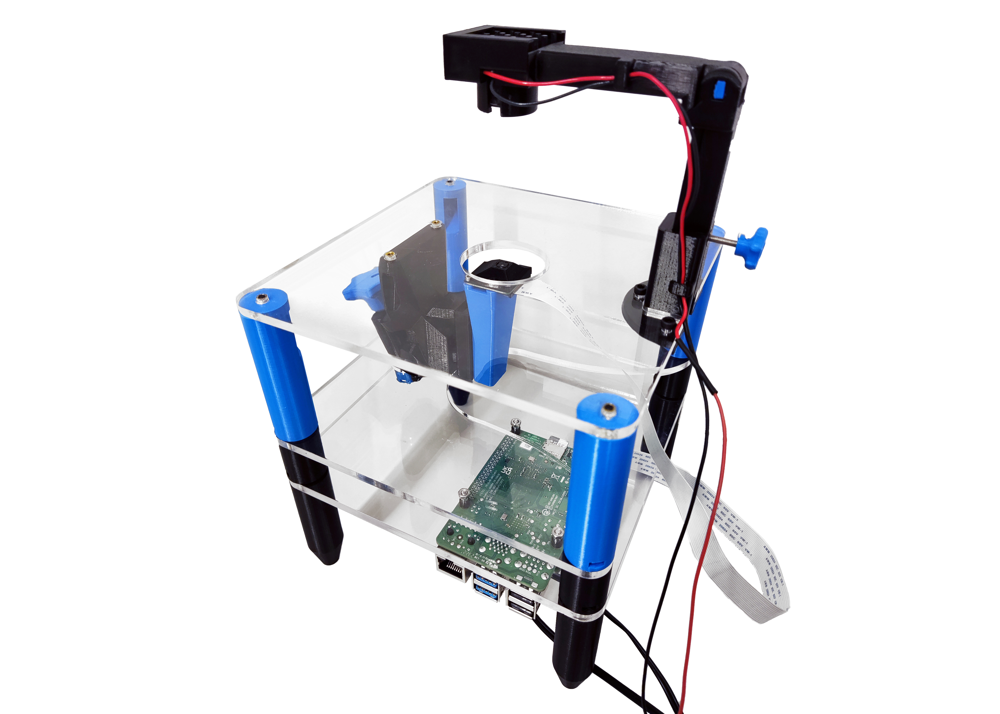

# 3-Level Microscope Station

This is the standard research version of the Strobe-Enhanced Microscope Station. It is a fully functioning laboratory grade microscope for imaging fast-moving objects.

Before you start building the station you will need to source all the components listed in our [bill of materials]{BOM}.

## Instructions

These instructions will take you through how to assemble the 3-levels version of the station. There is also a [2-levels version](https://librehub.github.io/2_Levels_Stage/) for education or other applications.

The assembly is broken up into several steps:

1. [.](printing.md){step}
1. [.](laser-cutting.md){step}
1. [.](assemble-focus-mechanism.md){step}
1. [.](basic-optics-module.md){step}
1. [.](attach-parts-to-top-plate.md){step}
1. [.](attach-parts-to-middle-plate.md){step}
1. [.](attach-parts-to-bottom-plate.md){step}
1. [.](mount-optics.md){step}
1. [.](wiring.md){step}
1. [.](illumination.md){step}
1. [.](finished.md){step}