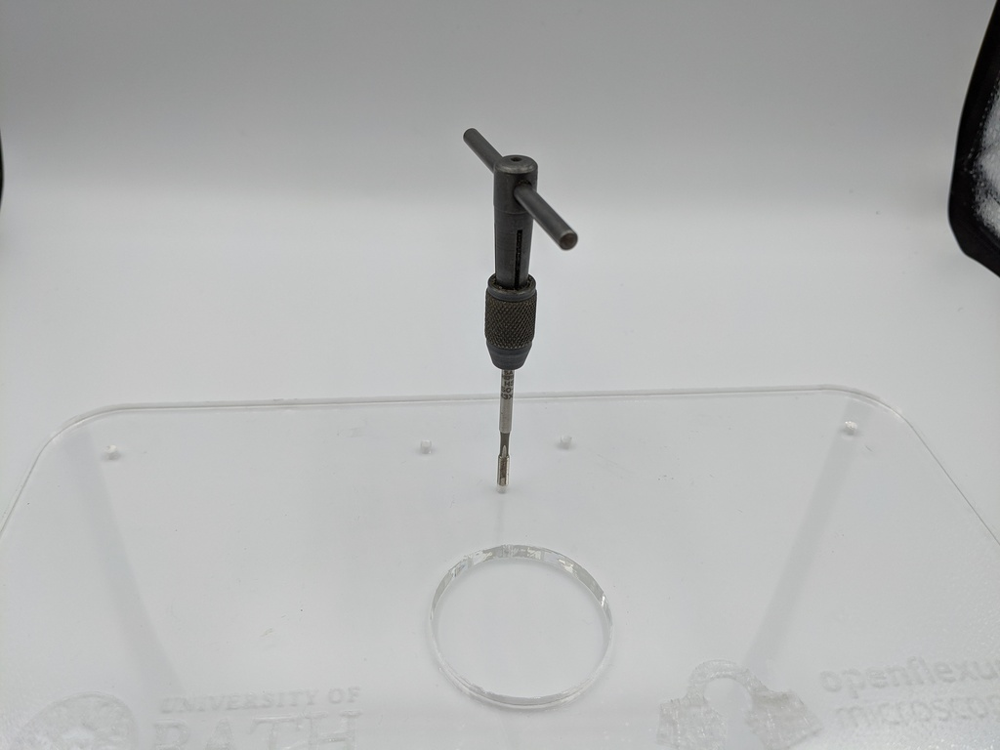
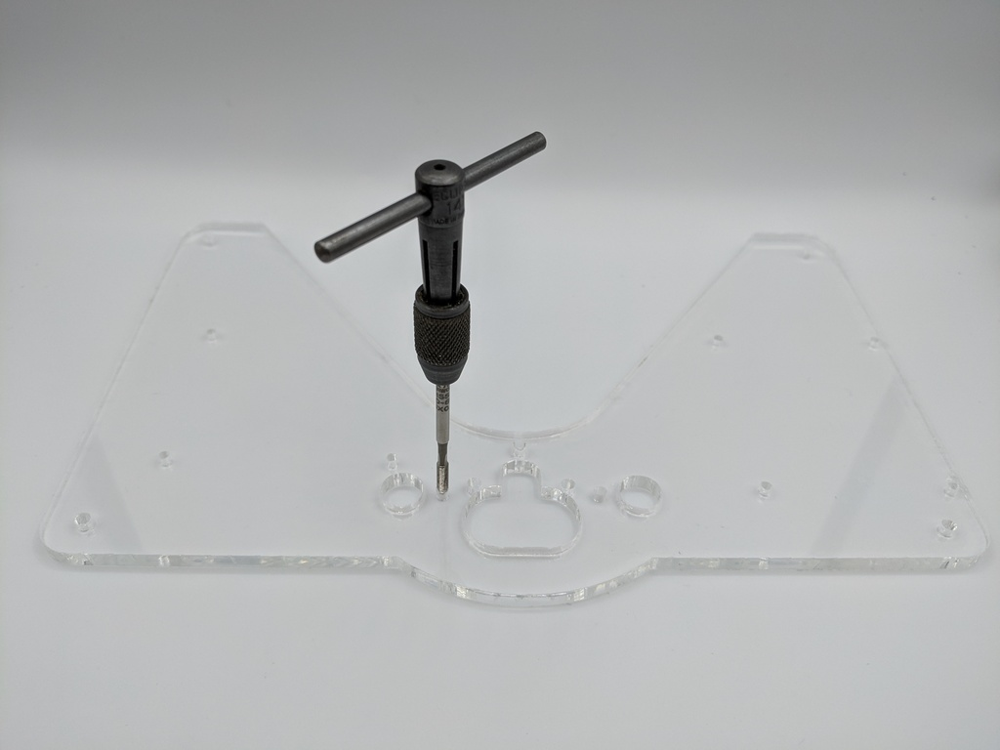

# Laser cut the acrylic parts

### Parts

* a little [lubricant]{: Class="bom"} 

### Tools

* 1 [Laser cutting machine]{: Class="bom"} 
* 1 [M3 tap]{: Class="bom"} 
* 1 [Tap wrench]{: Class="bom"} 

### Materials

* 1 [Acrylic sheet]{: Class="bom"} 

[Acrylic sheet]:parts/materials/acrylic_sheet.md ""
[Laser cutting machine]:parts/tools/laser_cutting_machine.md ""
[Tap wrench]:parts/tools/tap_wrench.md ""
[M3 tap]:parts/tools/m3_tap.md ""
[lubricant]:parts/consumables/tap_lubricant.md ""

## Step 1: Laser cutting {:id="laser-cutting" class="page-step"}

Now you have tested your [laser cutting machine][Laser cutting machine] and [acrylic sheet][Acrylic sheet] you can laser cut the following parts:

* Top plate: [top-plate.dxf](models/top-plate.md "")
* Bottom plate: [botton-plate.dxf](models/botton-plate.md "")

## Step 2: Clean up through holes {:id="clean-up-through-holes" class="page-step"}

Before assembling the microscope, you will need to tap the holes in the laser cut acrylic sheets so you can screw M3 screws into them.

## Method

The two laser-cut perspex sheets, the [top plate] and the [bottom plate], have a number of holes in them that need to be tapped.

### Tap holes in the top plate
Use an [M3 tap] mounted in a [tap wrench] to tap all the holes in the [top plate]{: Class="missing"}.  It helps to use some [lubricant] when you tap the holes, and to make 2 turns "screwing in" the tap then half a turn "unscrewing" as described in the [guide to tapping acrylic].  All of the holes in the [top plate] are intended to be tapped, there are no M3 through holes here.  It's probably easiest to tap the holes before removing any protective film from the acrylic, to help keep any debris off the plastic.

### Tap holes in the bottom plate
There are several holes in the [bottom plate]{: Class="missing"} that should be tapped.  However, there are both tapped and through holes in the bottom plate: if the hole is too big, and the [M3 tap]] fits in without "biting" the plastic, you probably don't need to tap the hole.  The most important two holes to tap at this point are the ones either side of the focusing method, where the tap wrench is placed in the photo below.  The others can all be tapped later if required.

### Clean up through holes
If any of the M3 clearance holes in the bottom plate are too tight to get an M3 screw through comfortably, you could open them up using a 3mm drill bit at this point.

### Remove film
If there is protective film on the acrylic, remove it now.

Your plates are now prepared and ready to use.

[guide to tapping acrylic]:http://www.ultimatehandyman.co.uk/how-to/acrylic/tapping-acrylic ""

---

[Previous page](printing.md) | [Next page](testpage1.md)