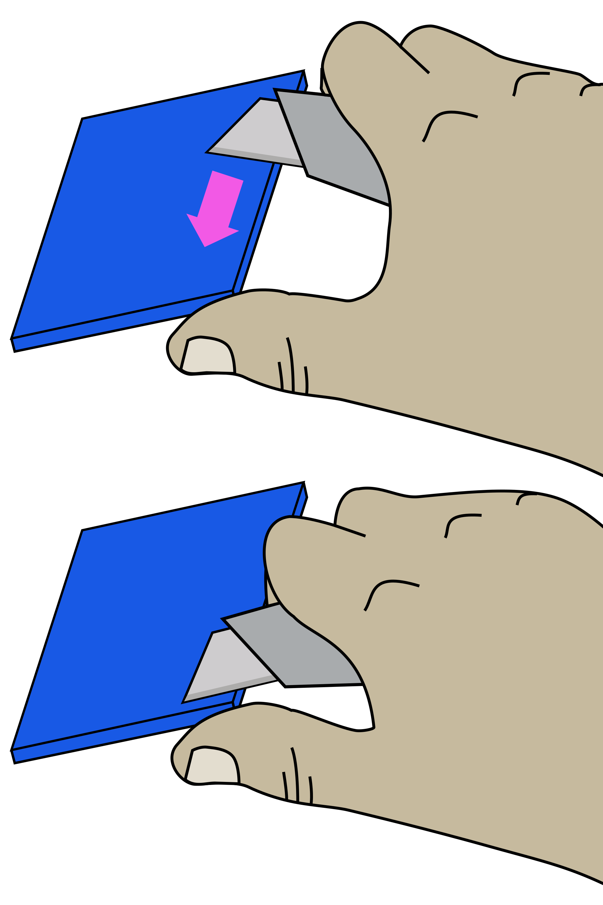

# Print the plastic parts

### Tools

* 1 [Precision wire cutter]{: Class="bom"} 
* 1 [RepRap-style printer]{: Class="bom"} 
* 1 [utility knife]{: Class="bom"}    - Not a scalpel!

### Materials

* 50 g of [Black PLA filament]{: Class="bom"} 
* 200 g of [PLA filament]{: Class="bom"}    - Of any colour you want

[PLA filament]:parts/materials/pla_filament.md ""
[Black PLA filament]:parts/materials/black_pla_filament.md ""
[RepRap-style printer]:parts/tools/rep-rap.md ""
[Precision wire cutter]:parts/tools/precision-wire-cutters.md ""
[utility knife]:parts/tools/utility-knife.md ""

## Step 1: Printing {:id="printing" class="page-step"}

Now you have tested your [3D printer][RepRap-style printer] and [filament][PLA filament] you can print the following parts:

* Actuator assembly tools: [actuator_assembly_tools.stl](models/actuator_assembly_tools.md "")
* Focusing assembly: [focusing-assembly.stl](models/focusing-assembly.md "")
* Foot: [foot.stl](models/foot.md "")
* Thumbwheel: [thumbwheel.stl](models/thumbwheel.md "")
* Pi camera platform: [camera-platform.stl](models/camera-platform.md "")
* Lens spacer: [lens-spacer.stl](models/lens-spacer.md "") - **This must be printed in [black][Black PLA filament]!**
* Illumination base: [illumination-base.stl](models/illumination-base.md "")
* Illumination slider: [illumination-slider.stl](models/illumination-slider.md "")
* Illumination thumbscrew: [illumination-thumbscrew.stl](models/illumination-thumbscrew.md "")
* Illumination arm: [led-arm.stl](models/led-arm.md "")
* LED cover: [led-cover.stl](models/led-cover.md "")
* Standoffs: [standoffs.stl](models/standoffs.md "")

## Step 2: Clean-up of printed parts {:id="clean-up-of-printed-parts" class="page-step"}

**Be careful when removing brim**

To avoid injury first remove the bulk of the brim without a knife. Remove the remaining brim with a peeling action as described below.

Carefully remove the printing brim from all parts (except the main body).

To remove brim:

1. Use [precision wire cutters][Precision wire cutter] to remove most of the brim from the part.
2. Clean up remaining brim with a [utility knife][utility knife]:
    * Hold the knife in your dominant hand with 4 fingers curled around the handle, leaving thumb free.
    * Hold the part in your other hand, as far away from the surface to be cut as possible.
    * Support the part with the thumb of your dominant hand.
    * Place blade on surface to be cut, and carefully close your dominant hand moving the blade, under control, towards your thumb.

---

[Previous page](index_BOM.md) | [Next page](laser-cutting.md)