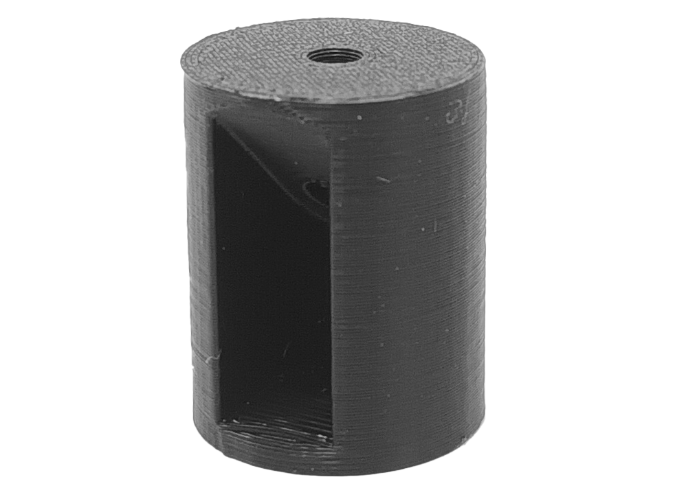
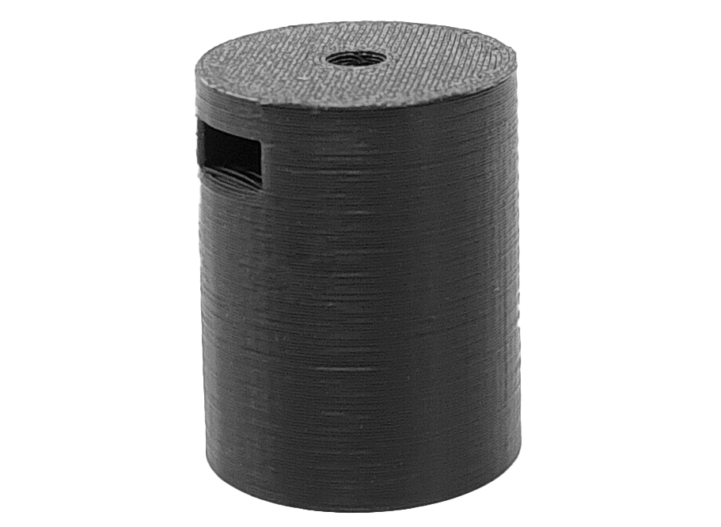
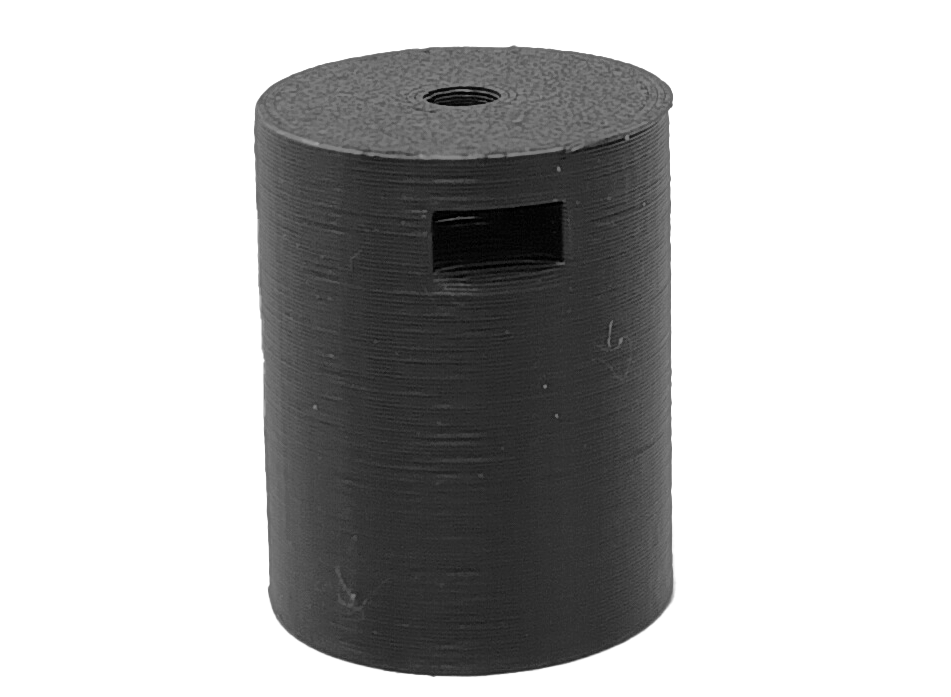

# Short middle leg

It consists of two crucial components: a side entrance for diagonal screw insertion and an opposite nut holder. By placing a nut in the holder, the various legs and plates can be connected using screws. Furthermore, these elements intersect with the main screw hole that spans from top to bottom.

