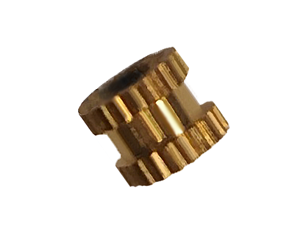
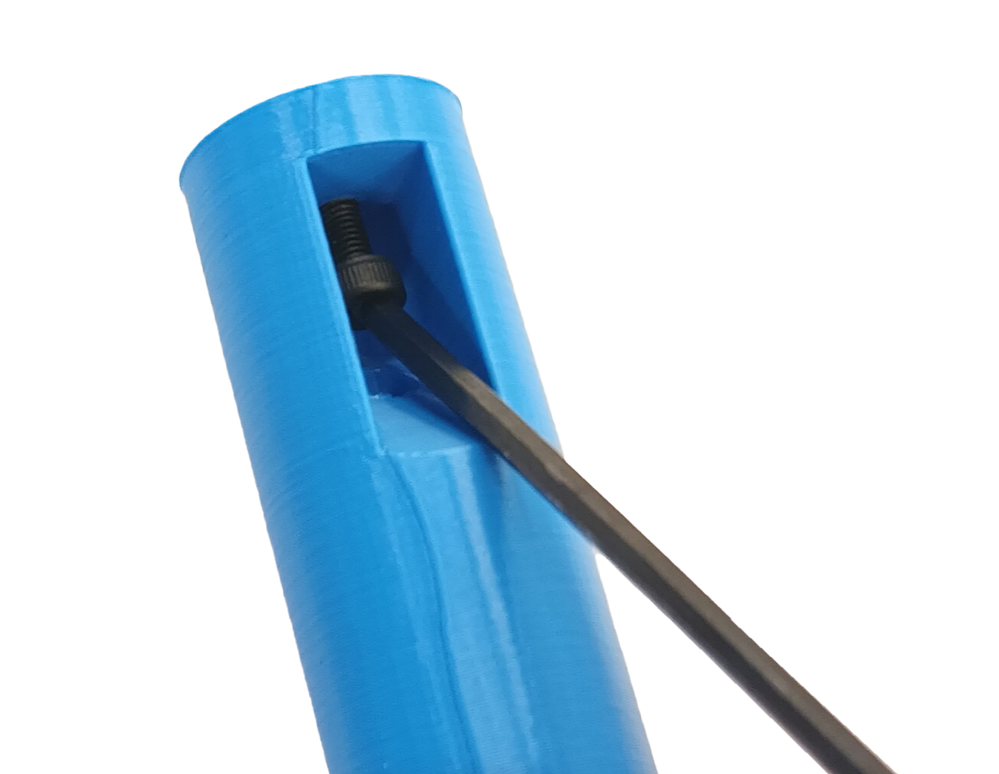
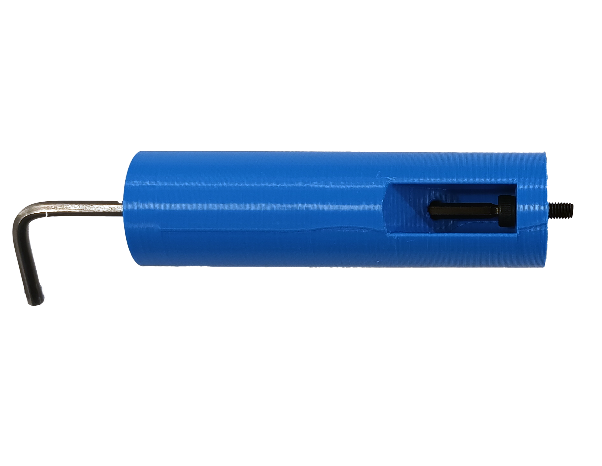
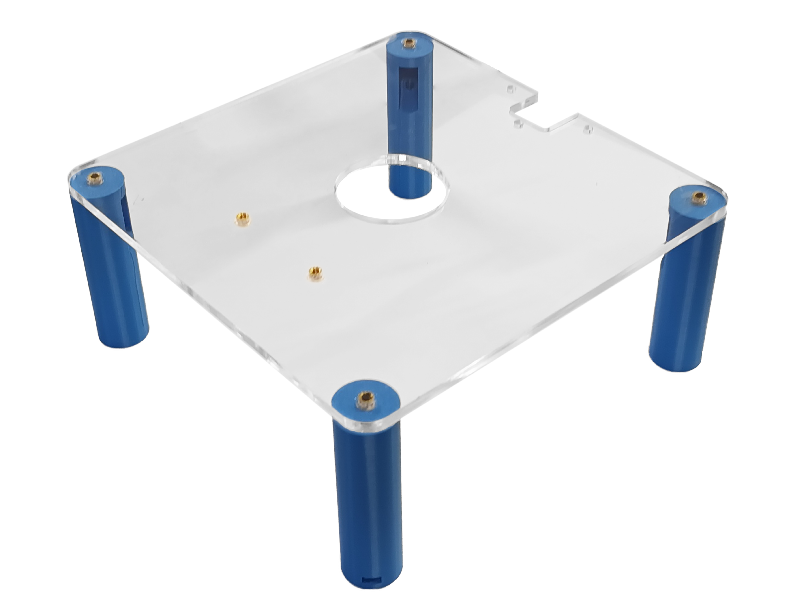
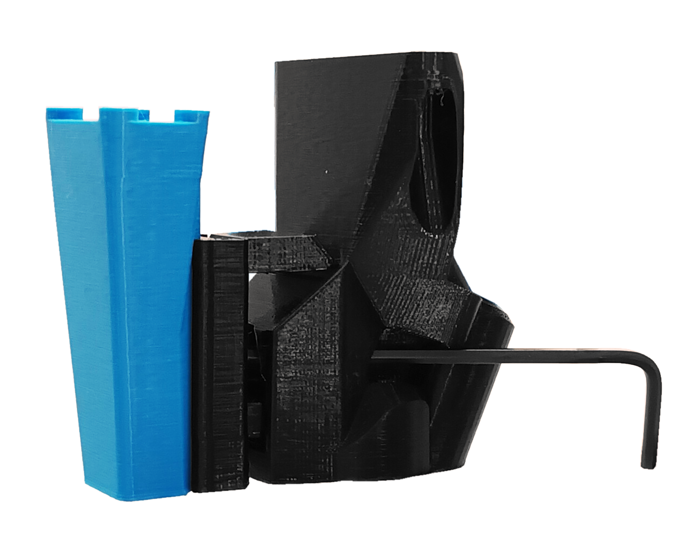
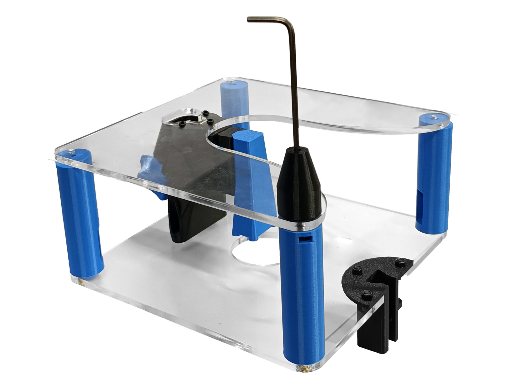
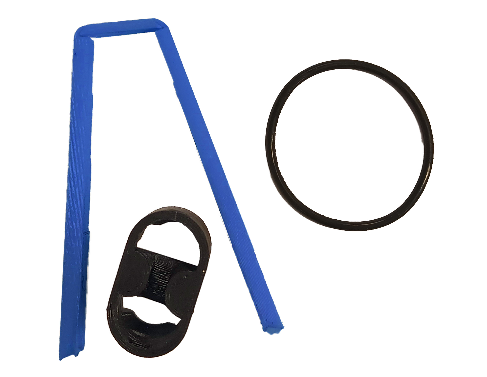
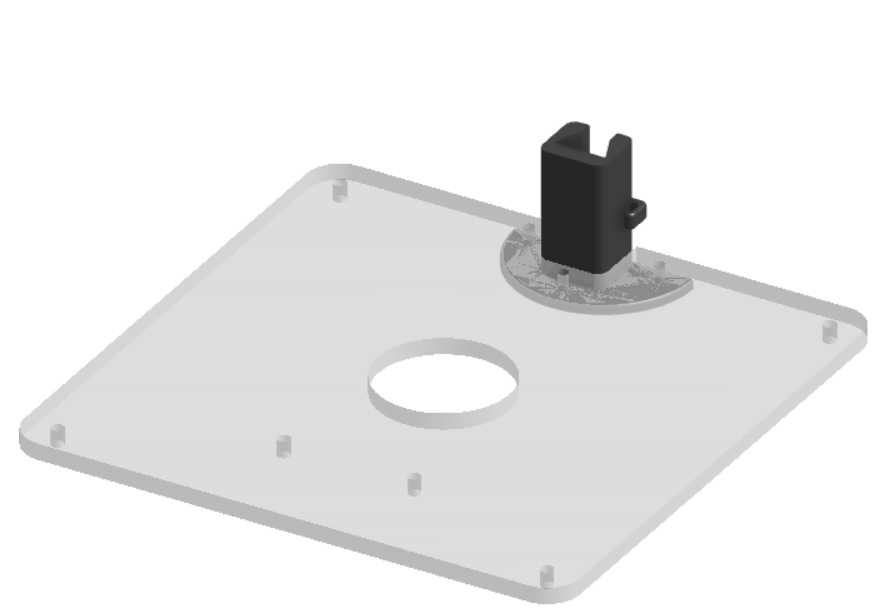
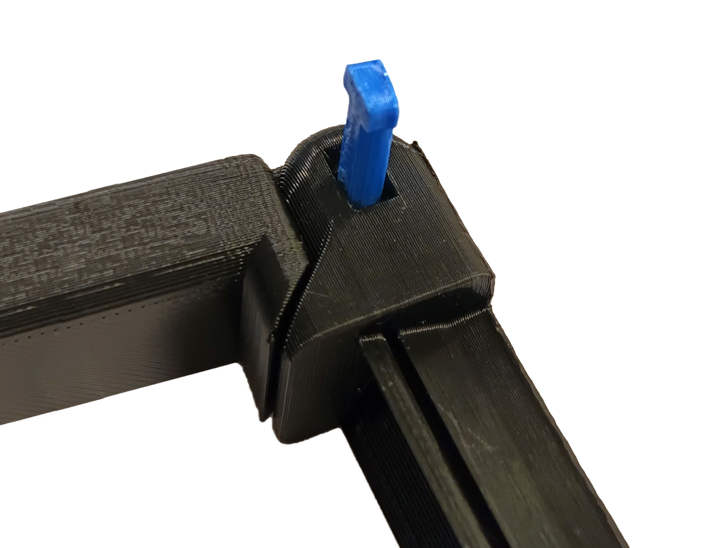

#Building
### 2 Levels Stage

### Parts

* 6 [heat inserts]{: Class="bom"} 
* 10 [M3 nut]{: Class="bom"} 
* 11 [M3x10 screw]{: Class="bom"} 
* 4 [M3x15 screw]{: Class="bom"} 
* 1 [M3x20 HEX screw]{: Class="bom"} 
* 1 [M3x20 X screw]{: Class="bom"} 
* 2 [M3x5 screw]{: Class="bom"} 
* 1 [O ring]{: Class="bom"} 
* 2 [screw washers]{: Class="bom"} 

### Tools

* 1 [M3 HEX key]{: Class="bom"} 
* 1 [piler]{: Class="bom"} 
* 1 [screwdriver]{: Class="bom"} 
* 1 [soldering iron]{: Class="bom"} 

### Printed Parts

* 1 [actuator foot]{: Class="bom"} 
* 1 [base of the light holder]{: Class="bom"} 
* 1 [camera holder]{: Class="bom"} 
* 1 [cap of the light holder]{: Class="bom"} 
* 1 [focusing regulator]{: Class="bom"} 
* 1 [hinge of the light holder]{: Class="bom"} 
* 1 [main knob]{: Class="bom"} 
* 4 [short base legs]{: Class="bom"} 
* 1 [slide knob]{: Class="bom"} 
* 1 [sliding piece of the light holder]{: Class="bom"} 
* 4 [upper legs]{: Class="bom"} 

### Printed Tools

* 1 [gripper]{: Class="bom"} 
* 1 [nut pusher]{: Class="bom"} 

### Laser cut parts

* 1 [middle plate]{: Class="bom"} 
* 1 [upper plate]{: Class="bom"} 

## First level 

#####With all the necessary station pieces in hand, proceed to insert the six [heat inserts]  for M3 screws into the top [upper plate]. Apply heat using a [soldering iron] and exert pressure on the designated 6 laser-cut holes.

#####Follow a top-to-bottom building approach connecting the [upper legs] to the borders and the [focusing regulator] to the center. 

* Insert the [M3x10 screw] diagonally into the lateral space in the upper leg, ensuring a proper fit. Apply additional pressure if necessary to secure the connection, then do the same with the other three.

* Next, pass the [M3 HEX key] through the leg and screw it into the heat insert and ensuring that the lateral hole points towards the center of the Station. 

* Additionally, you have the Focusing regulator. Join its pieces and proceed to screw it into the upper plate. Remember to complete this step before installing the [middle plate], as you won't be able to secure it otherwise.

 ---
#### Focusing regulator

##### Focusing regulator pieces. 
 * Start by screwing the [camera holder] with the [M3 nut] inside using the hex key to adjust a [M3x10 screw] to it. Insert the hex key through the focusing regulator and adjust the camera holder according to the specific camera that will be used later.

*  Following the camera holder, attach the [main knob] with its [M3x20 HEX screw] screw, which should have a hexagonal head. Place the two [screw washers] with their round edges against each other. Insert an [M3 nut] into the focusing regulator hole and use the [nut pusher] 3D printed tool to push it in. Finally, screw the main knob into place.

##### Focusing regulator assembly:
* Position the assembled focusing regulator against the upper plate and secure it with two [M3x5 screw] into the remaining heat inserts. Ensure that the main knob is pointing outward from the station.

---------

#####Lastly, at this stage, secure the [base of the light holder] by using three [M3x10 screw] screws and three [M3 nut]. Ensure that the printed plate of the base and the nuts are positioned beneath the plate.

 --------

## Second level 

#####Moving on to the base level, position the focusing regulator and secure it in place using three [M3x10 screw], inserting them directly into the corresponding holes in the printing until the head of the screw touches the middle plate.

#####Next, proceed to screw the four[short base legs] into the middle plate using a [M3x15 screw]. Insert the screw diagonally, similar to the upper leg, and then secure it into a [M3 nut] placed into the remaining hole of the upper leg. Repeat this process for the other four legs. Once all legs are securely screwed, ensure that the base legs are aligned in the same direction as the upper legs.

#####Thirdly, proceed to insert the [O ring] into the focusing regulator, with the [actuator foot] positioned in between. Utilize the [gripper] to assist in the insertion process. Apply pressure to push the O-ring until it clicks securely into place at the end.

#####Finally, for this station, assemble the pieces of the light holder and then place it into the base on the top plate.

* To accomplish this, begin by inserting the heat insert into the [sliding piece of the light holder]. Then, proceed to screw the [slide knob] into the heat insert with a [screwdriver]. For the knob itself, place a [M3 nut] in the middle space and secure it by screwing it tightly with a [M3x20 X screw]20mm M3 cross head screw.

* Once you have completed the previous step, proceed to place the [hinge of the light holder] between the arm and the sliding piece. You can use a [piler] to assist in positioning the hinge accurately.

After completing all the previous steps, proceed to install the lens and electronics into their designated positions within the station. Ensure the lens is securely placed for optimal performance, connect the electronics to the appropriate ports, and insert the [cap of the light holder] to provide protection and efficient light distribution. With these final elements in place, your microfluidic working station will be fully equipped and ready for effective use in your scientific endeavors.

[heat inserts]:Hinsert.md ""
[upper plate]:PMMA.md ""
[soldering iron]:soldiron.md ""
[upper legs]:ulegs.md ""
[focusing regulator]:f-regulator.md ""
[M3x10 screw]:mthree.md ""
[M3 HEX key]:hexkey.md ""
[middle plate]:PMMA.md ""
[camera holder]:cameraholder.md ""
[M3 nut]:nuts.md ""
[main knob]:mainknob.md ""
[M3x20 HEX screw]:hexscrew.md ""
[screw washers]:washer.md ""
[nut pusher]:nutpusher.md ""
[M3x5 screw]:mthreefive.md ""
[base of the light holder]:lightholder.md ""
[short base legs]:shortbaseleg.md ""
[M3x15 screw]:mthreefifteen.md ""
[O ring]:oring.md ""
[actuator foot]:actuatorfoot.md ""
[gripper]:gripper.md ""
[sliding piece of the light holder]:lightholder.md ""
[slide knob]:lightholder.md ""
[screwdriver]:screwdriver.md ""
[M3x20 X screw]:xscrew.md ""
[hinge of the light holder]:lightholder.md ""
[piler]:piler.md ""
[cap of the light holder]:lightholder.md ""

---

[Previous page](testpage1.md) | [Next page](testpage5.md)