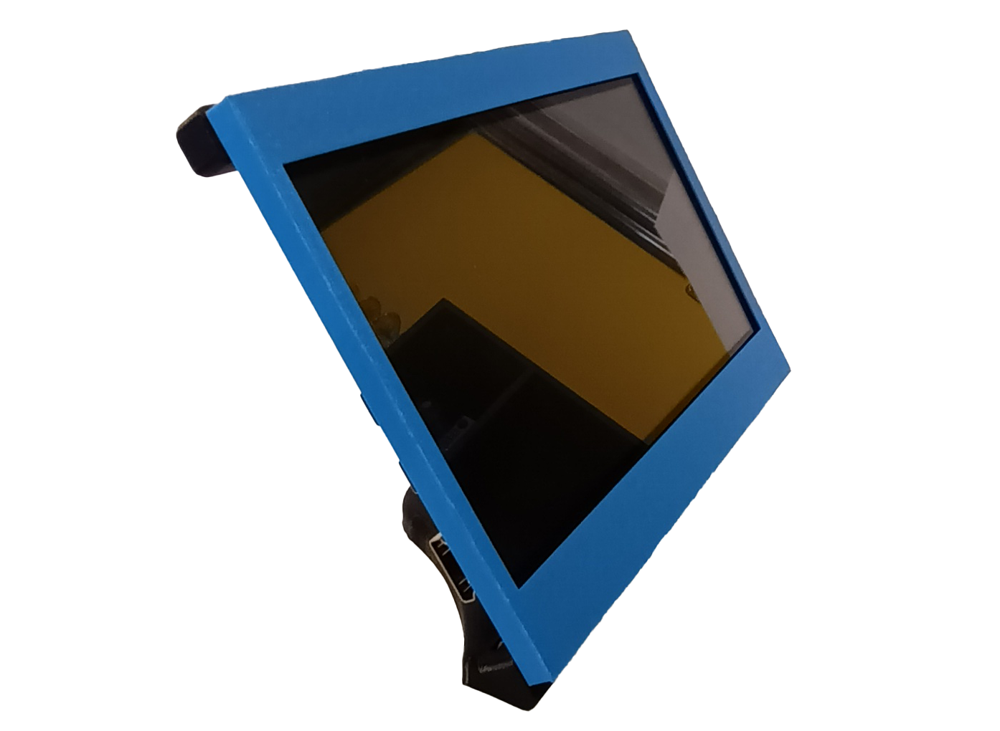
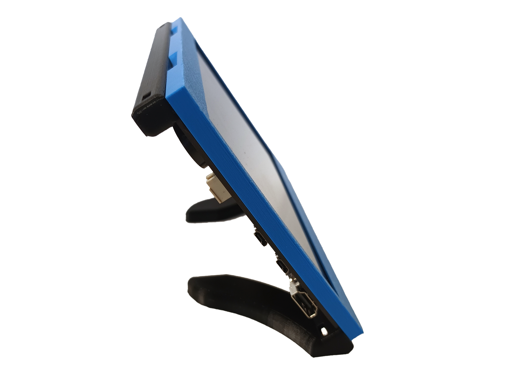
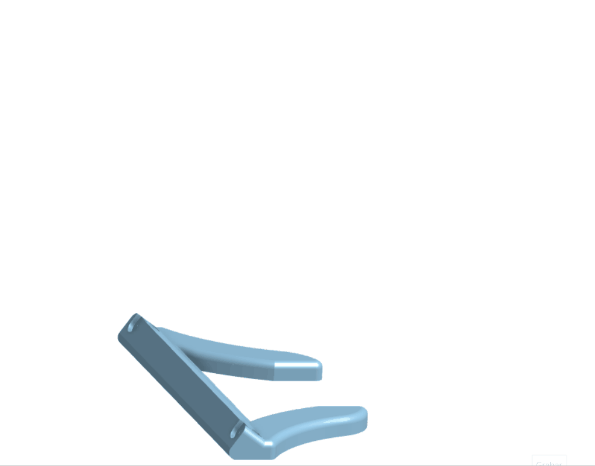

# Screen holder
###Building

### Parts

* 1 [7-inch capacitive touch screen for Raspberry Pi]{: Class="bom"} 
* 4 [M3 nut]{: Class="bom"} 
* 4 [M3x10 screw]{: Class="bom"} 

### Tools

* 1 [M3 HEX key]{: Class="bom"} 

### Printed Parts

* 1 [base piece]{: Class="bom"} 
* 1 [screen cover]{: Class="bom"} 
* 1 [top piece]{: Class="bom"} 

When it comes to the screen holder made for the [7-inch capacitive touch screen for Raspberry Pi], the process is quite straightforward. 

All you need to do is follow a few simple steps. First, gather four [M3x10 screw] and four [M3 nut]. Securely screw the corresponding parts onto the screen using the[M3 HEX key], ensuring that each screw is tightly fastened and each nut is securely plugged into the [top piece] and [base piece]. 

Once the parts are firmly in place, you can proceed to attach the [screen cover]. 
Simply align the protector with the screws and carefully affix it to ensure a snug fit. By following these steps, you'll be able to effectively install the screen holder and safeguard your device's display.
[7-inch capacitive touch screen for Raspberry Pi]:https://es.aliexpress.com/item/1005004248297471.html?pdp_npi=2%40dis%21CLP%21CLP8.211%21CLP6.572%21%21%21%21%21%402101c5c216845279301748667e7f22%2112000028516842616%21btf&_t=pvid%3A1633c580-e52f-49bd-8d4e-dc5f8abeaa50&afTraceInfo=1005004248297471__pc__pcBridgePPC__xxxxxx__1684527930&spm=a2g0o.ppclist.product.mainProduct&gatewayAdapt=glo2esp ""
[M3x10 screw]:mthree.md ""
[M3 nut]:nuts.md ""
[M3 HEX key]:hexkey.md ""
[top piece]:screenholder.md ""
[base piece]:screenholder.md ""
[screen cover]:screenholder.md ""

---

[Previous page](testpage2.md) | [Next page](Information.md)