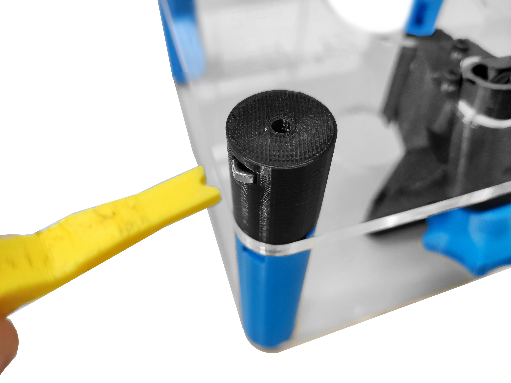
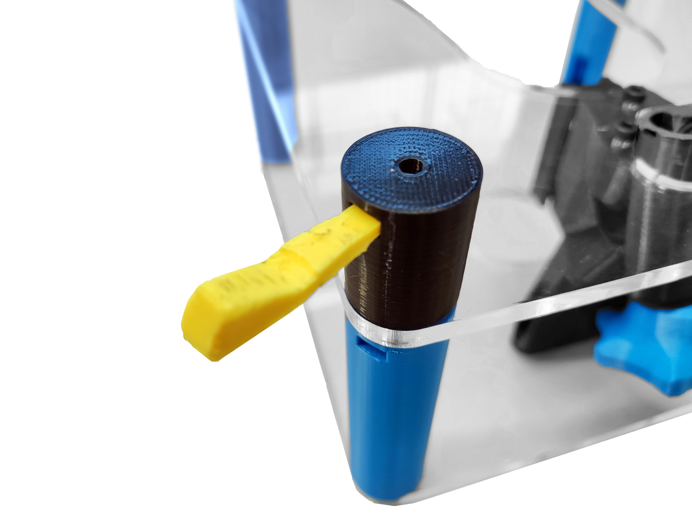
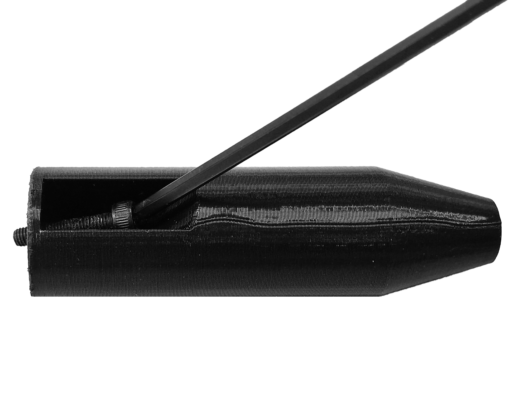
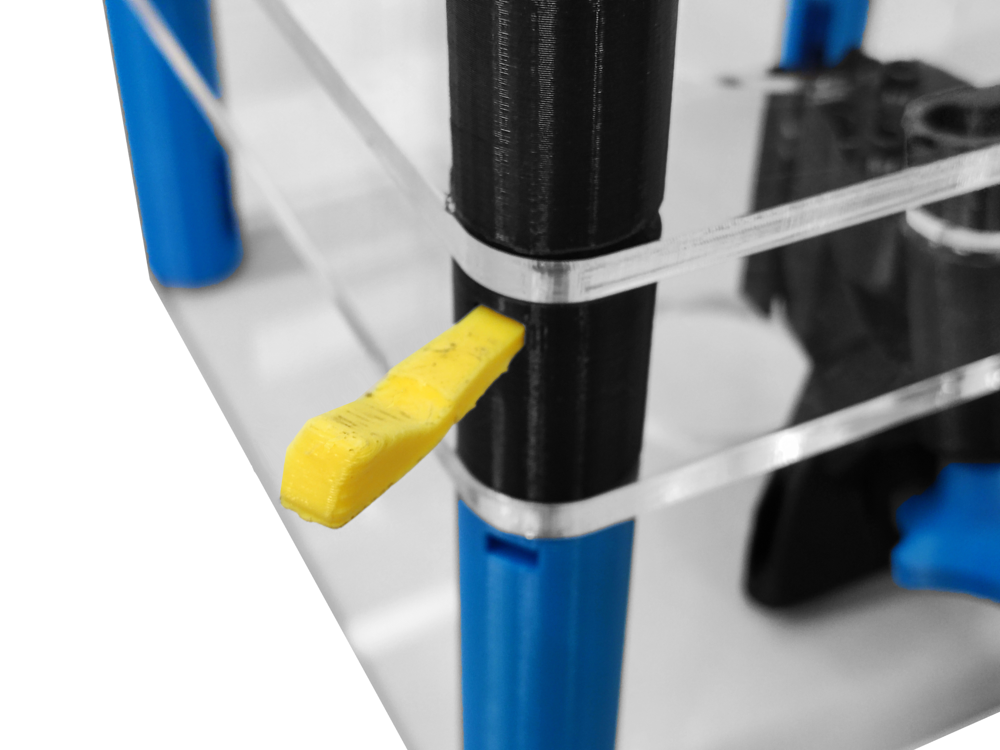
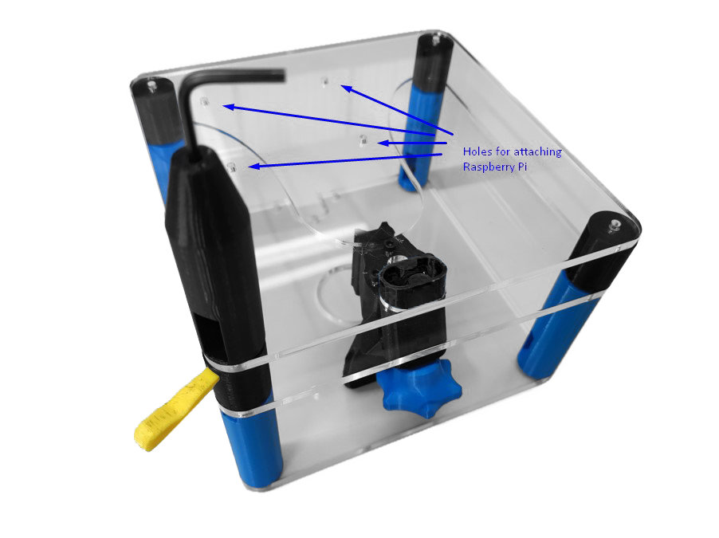
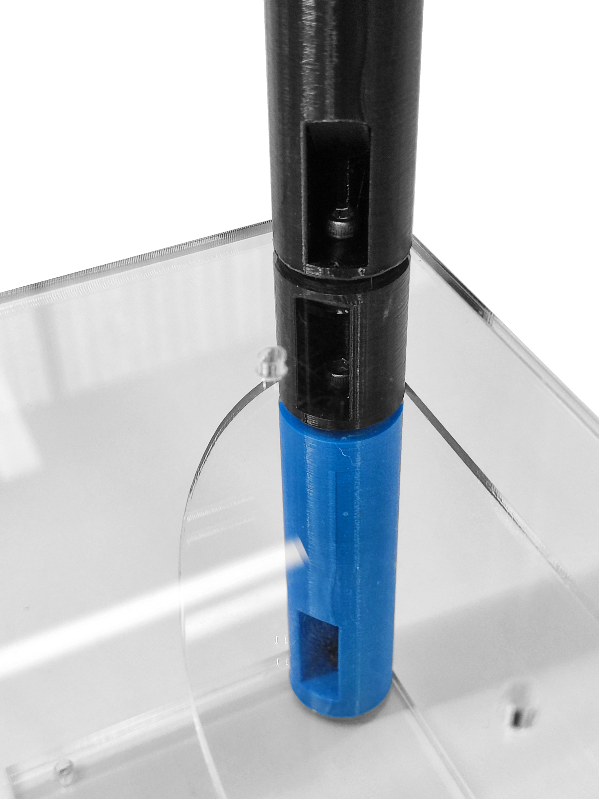
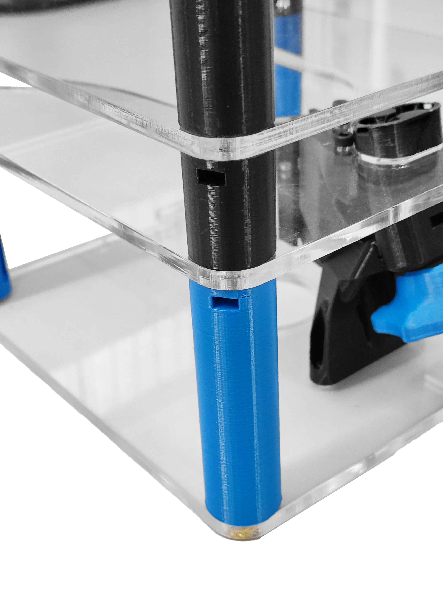
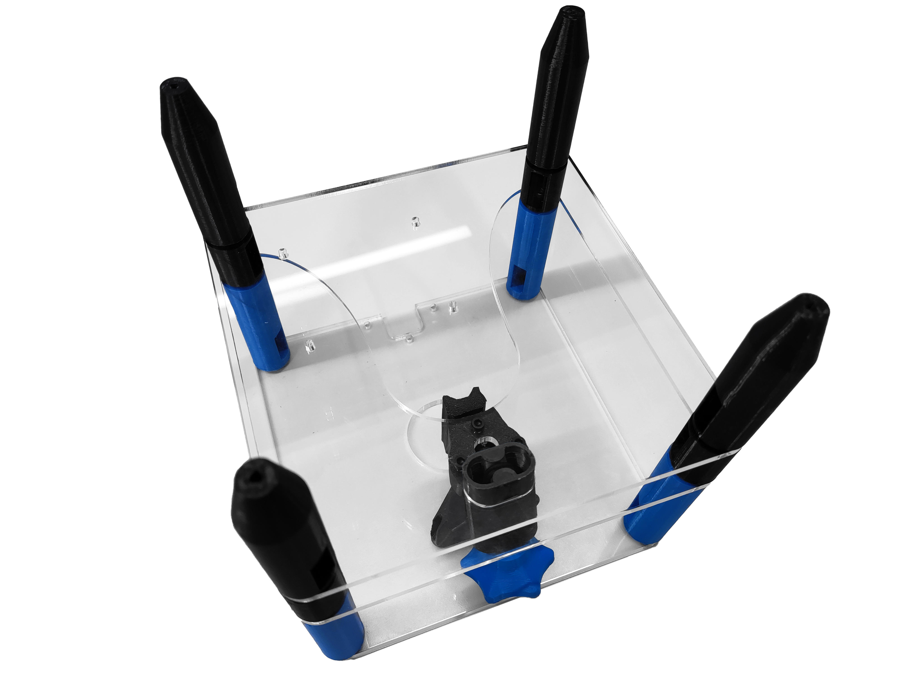
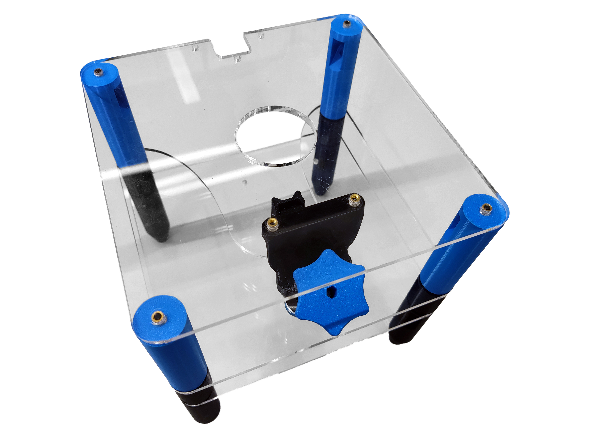

# Attach parts to the bottom plate

{{BOM}}

[M3x15mm cap head screw]: parts/mech/M3-15.md "{cat:mechanic}"
[M3 nut]: parts/mech/nuts.md "{cat:mechanic}"
[2.5mm Ball-end Allen key]: parts/tools/2.5mmBallEndAllenKey.md "{cat:tool}"
[Bottom plate]: parts/materials/bottom-plate.md "{cat:lasercutpart}"
[Standoff-S]: models/standoff-S.stl "{previewpage}"
[Foot-M]: models/foot-M.stl "{previewpage}"
[Nut tool]: models/actuator-assembly-tools.stl "{previewpage}"

## Prepare the small standoffs {pagestep}

* Take an [M3 nut]{qty:4} and push it into the nut trap from the small [standoff][Standoff-S]. Insert one into each of the standoffs using the [nut insertion tool][Nut tool](fromstep){qty:1, cat:printedtool}.

## Prepare the feet {pagestep}

* Insert a [M3x15mm cap head screw]{qty: 4} into each [foot][Foot-M](fromstep){qty: 4, cat:printedpart} using the large hole that comes out the side of the [foot][Foot-M]. The screw should poke out the end of the part as shown.
* Use a [2.5mm ball-ended hex key][2.5mm Ball-end Allen key]{qty:1} to turn the screw.

## Attach the bottom plate and the foot {pagestep}

* Place the bottom plate above the small standoffs. The four holes for attaching the Raspberry Pi should be on the opposite side of the focusing mechanism, as shown.
* Attach each [foot][Foot-M] to one of the corners of the [bottom plate][Bottom plate](fromstep){qty:1}.
* Use the [nut insertion tool][Nut tool] and the [2.5mm ball-ended hex key][2.5mm Ball-end Allen key] to secure the three parts together.
* Nut traps should be accessible for future calibrations and upgrades.

At this point, the [main structure]{output,qty:1} is complete.

