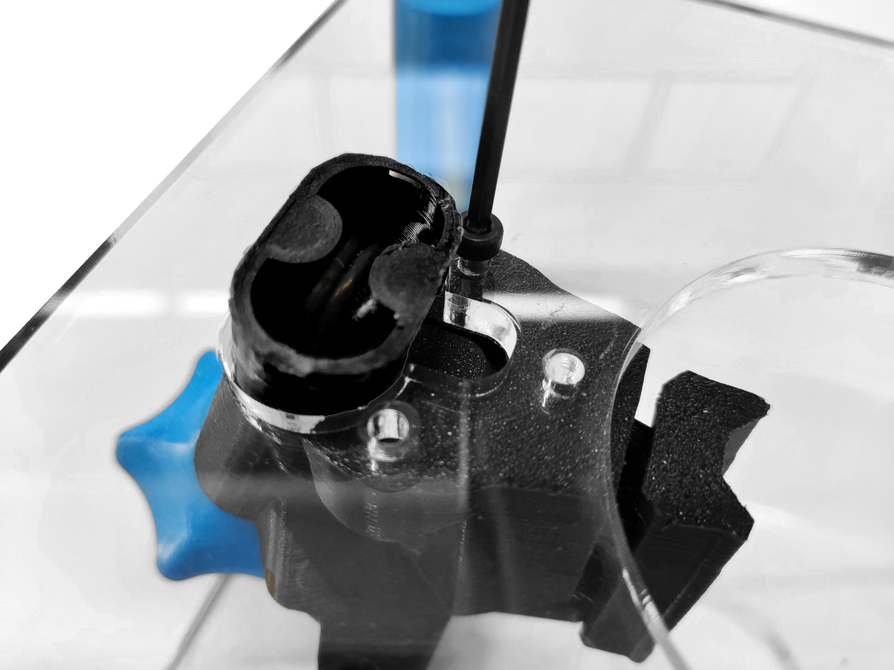
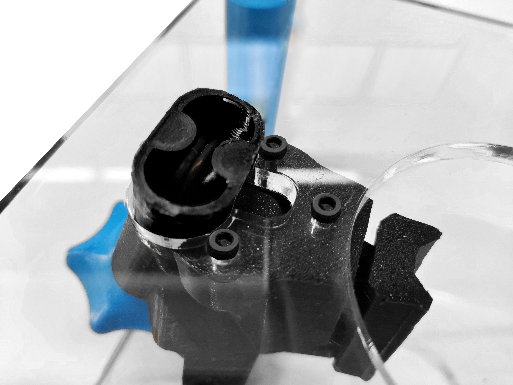
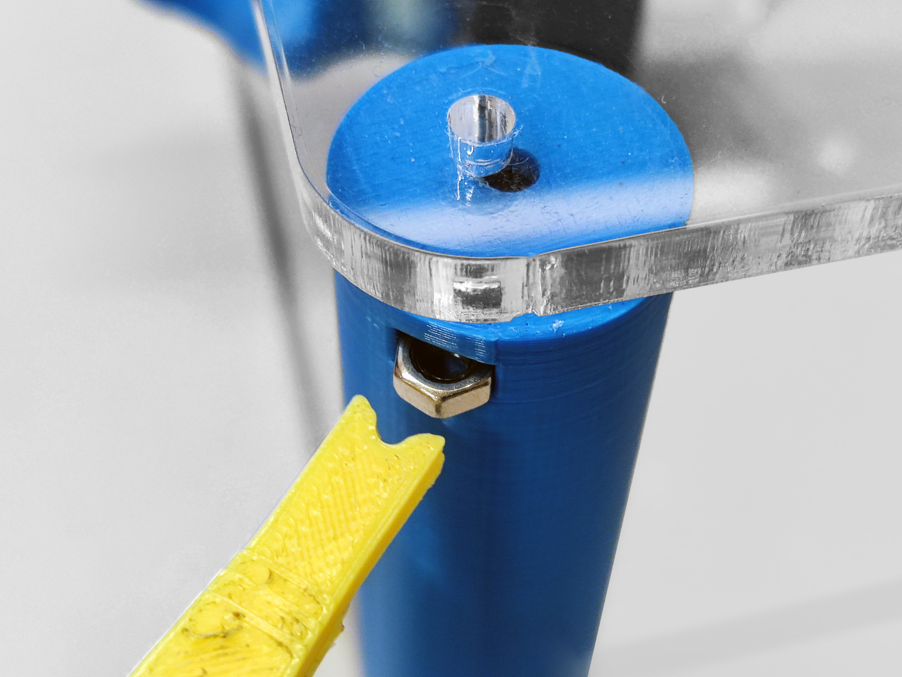
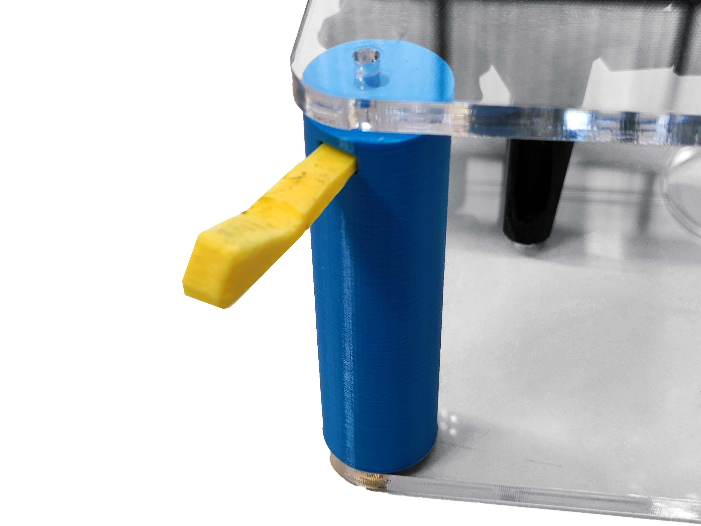
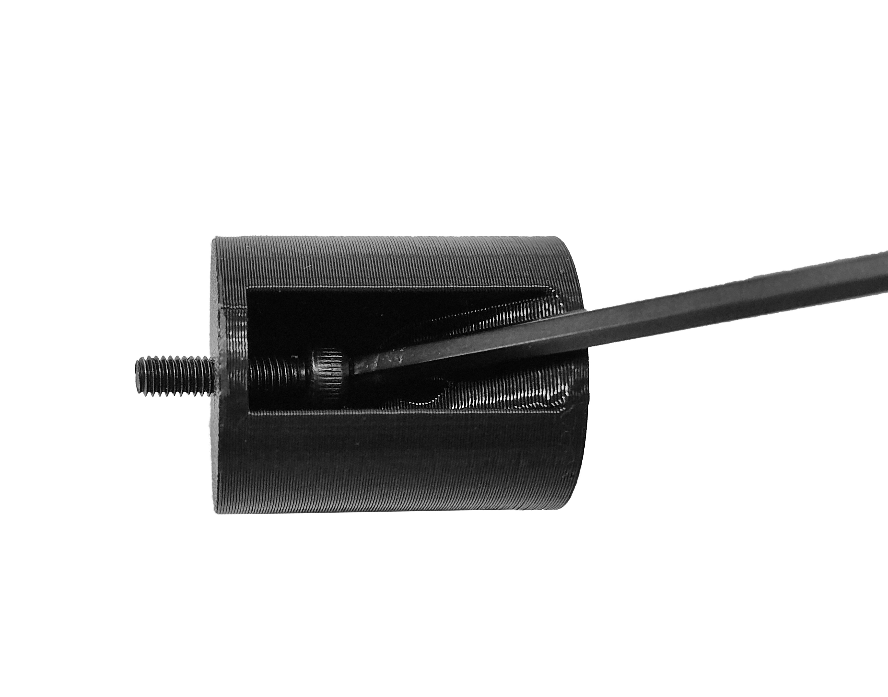
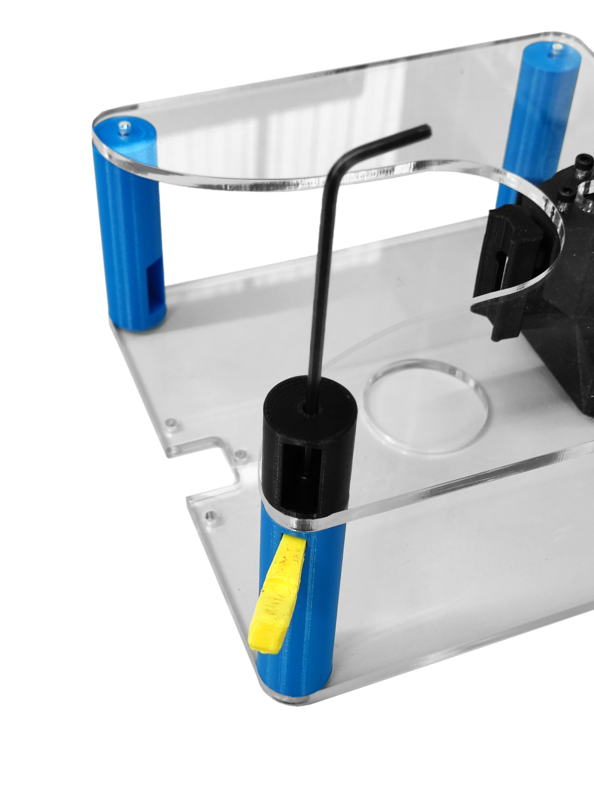
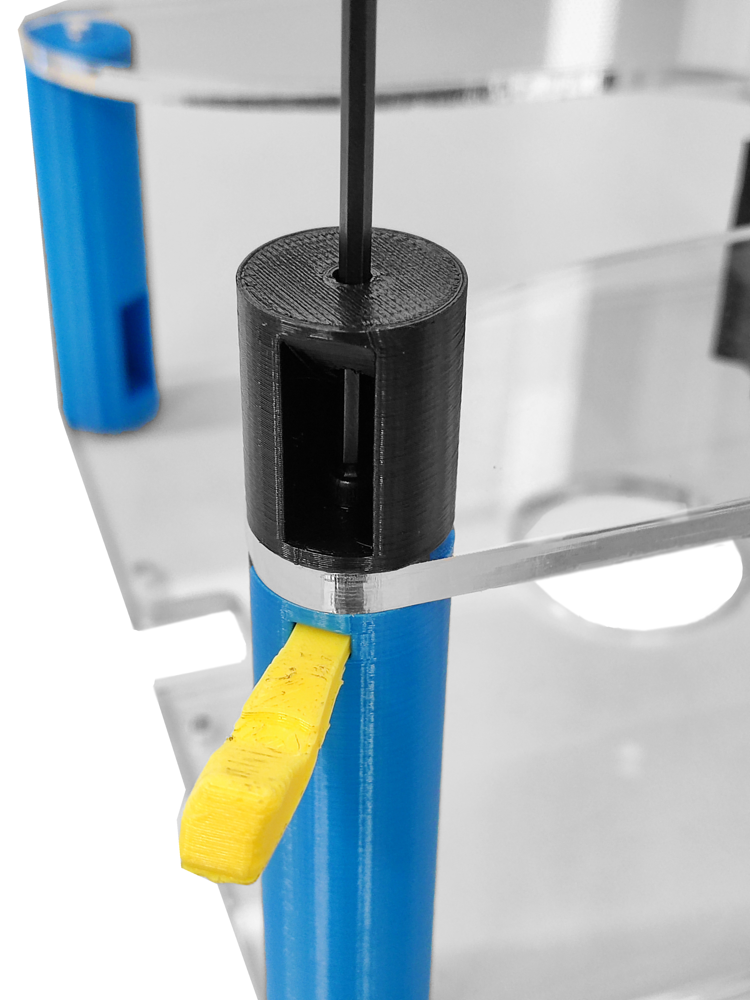
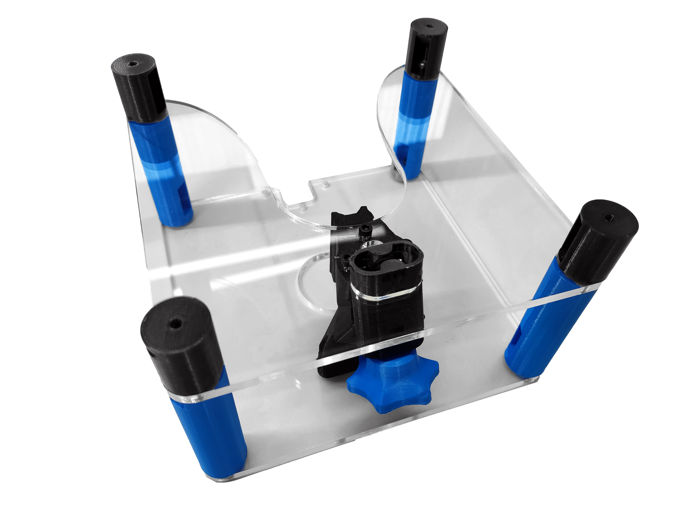

# Attach parts to the middle plate

{{BOM}}

[M3x10mm cap head screw]: parts/mech/M3-10.md "{cat:mechanic}"
[M3x15mm cap head screw]: parts/mech/M3-15.md "{cat:mechanic}"
[M3 nut]: parts/mech/nuts.md "{cat:mechanic}"
[Middle plate]: parts/materials/middle-plate.md "{cat:lasercutpart}"
[2.5mm Ball-end Allen key]: parts/tools/2.5mmBallEndAllenKey.md "{cat:tool}"
[Nut tool]: models/actuator-assembly-tools.stl "{previewpage}"
[Standoff-S]: models/standoff-S.stl "{previewpage}"
[Standoff-M]: models/standoff-M.stl "{previewpage}"

You will also need the parts you assembled in previous sections.

## Screw into the focusing assembly {pagestep}

* Attach the [middle plate][Middle plate](fromstep){qty:1} to the [focusing mechanism](fromstep) using three [M3x10mm cap head screws][M3x10mm cap head screw]{qty: 3}.
* Use a [2.5mm ball-ended hex key][2.5mm Ball-end Allen key]{qty:1} to turn the screws.

## Attach the small standoffs {pagestep}

* Insert a [M3 nut] into the nut trap of the [standoff][Standoff-M] (using the [nut insertion tool][Nut tool](fromstep){qty:1, cat:printedtool}). Do the same for the four standoffs.

* Insert a [M3x15mm cap head screw]{qty: 4} into each small [standoff][Standoff-S](fromstep){qty: 4, cat:printedpart} using the large hole that comes out the side of the [standoff][Standoff-S]. The screw should poke out the end of the part as shown.
* Use a [2.5mm ball-ended hex key][2.5mm Ball-end Allen key]{qty:1} to turn the screw.

* Attach each small [standoff][Standoff-S] to one of the corners of the [middle plate][Middle plate].
* Use the [nut insertion tool][Nut tool] and the [2.5mm ball-ended hex key][2.5mm Ball-end Allen key] to secure the other three parts.

