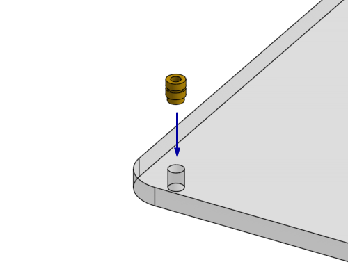
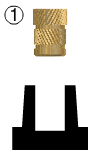
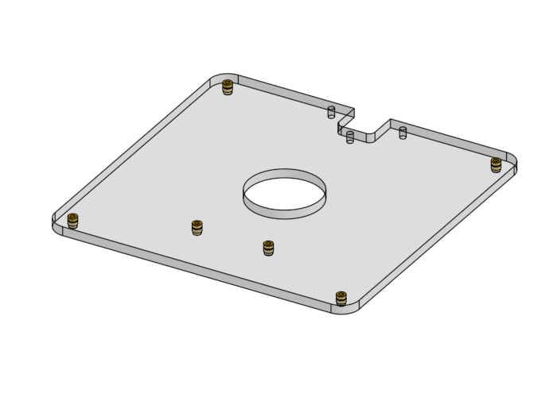
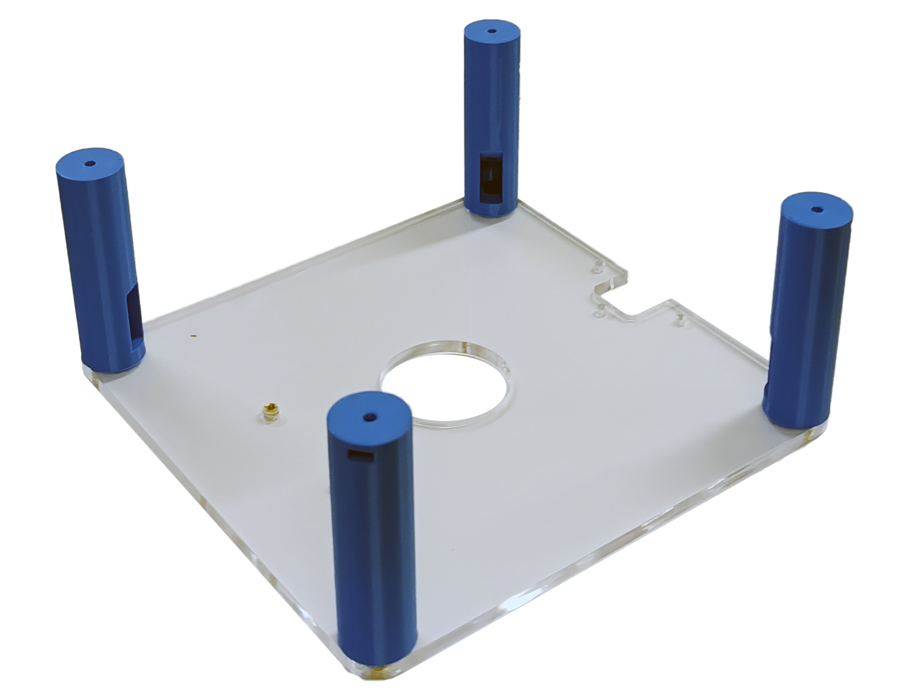
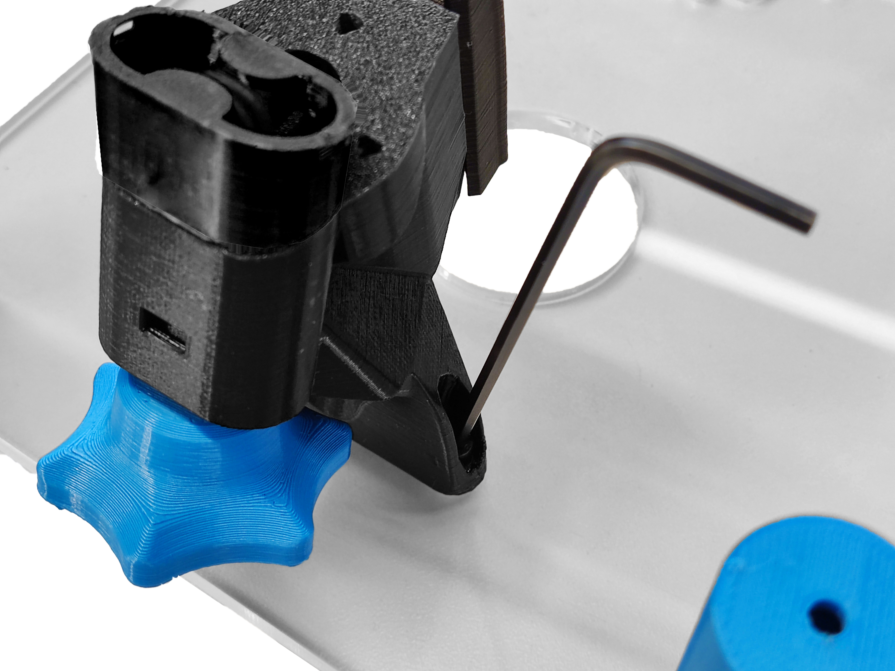
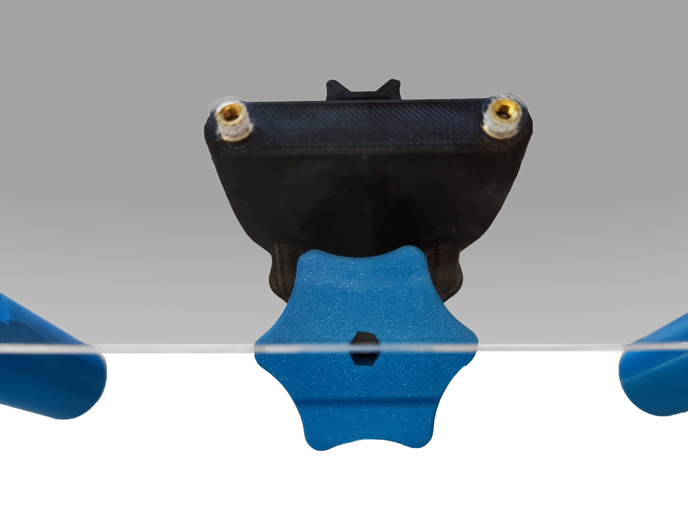

# Attach parts to the top plate

{{BOM}}

[Heat-set insert]: parts/mech/heat-set_insert.md "{cat:mechanic}"
[M3x6mm cap head screw]: parts/mech/m3x6_screw.md "{cat:mechanic}"
[M3x10mm cap head screw]: parts/mech/m3x10_screw.md "{cat:mechanic}" 
[Top plate]: parts/materials/top-plate.md "{cat:lasercutpart}"
[Soldering iron]: parts/tools/soldering-iron.md "{cat:tool}"
[2.5mm Ball-end Allen key]: parts/tools/2.5mmBallEndAllenKey.md "{cat:tool}"
[Focusing assembly]: models/focusing-assembly.stl "{previewpage}"
[Standoff-M]: models/standoff-M.stl "{previewpage}"

You will also need the parts you assembled in previous sections.

## Prepare the top plate {pagestep}

* Positionate a [heat-set insert][Heat-set insert]{qty:4} for each corner of the [top plate][Top plate](fromstep){qty:1}.
* Apply heat to the [insert][Heat-set insert] (using a [soldering iron][Soldering iron]{qty:1}) and use gentle force to push it into position as decribed in the [guide to use heat-set inserts].
* Repeat this step to put two more [inserts][Heat-set insert]{qty:2} in the plate to attach the focusing assembly.

## Prepare the standoffs {pagestep}

* Insert a [M3x10mm cap head screw]{qty: 4} into each [standoff][Standoff-M](fromstep){qty: 4, cat:printedpart} using the large hole that comes out the side of the [standoff][Standoff-M]. The screw should poke out the end of the part as shown.
* Use a [2.5mm ball-ended hex key][2.5mm Ball-end Allen key]{qty:1} to turn the screw.

## Attach the standoffs {pagestep}

* Attach each [standoff][Standoff-M] to one of the corners of the [top plate][Top plate].

## Attach the focusing assembly {pagestep}

* Use a [M3x6mm cap head screw]{qty: 2} on either side of the [focusing mechanism](fromstep){qty:1, cat:subassembly}, attach it to the top plate.

[guide to use heat-set inserts]: https://hackaday.com/2019/02/28/threading-3d-printed-parts-how-to-use-heat-set-inserts/