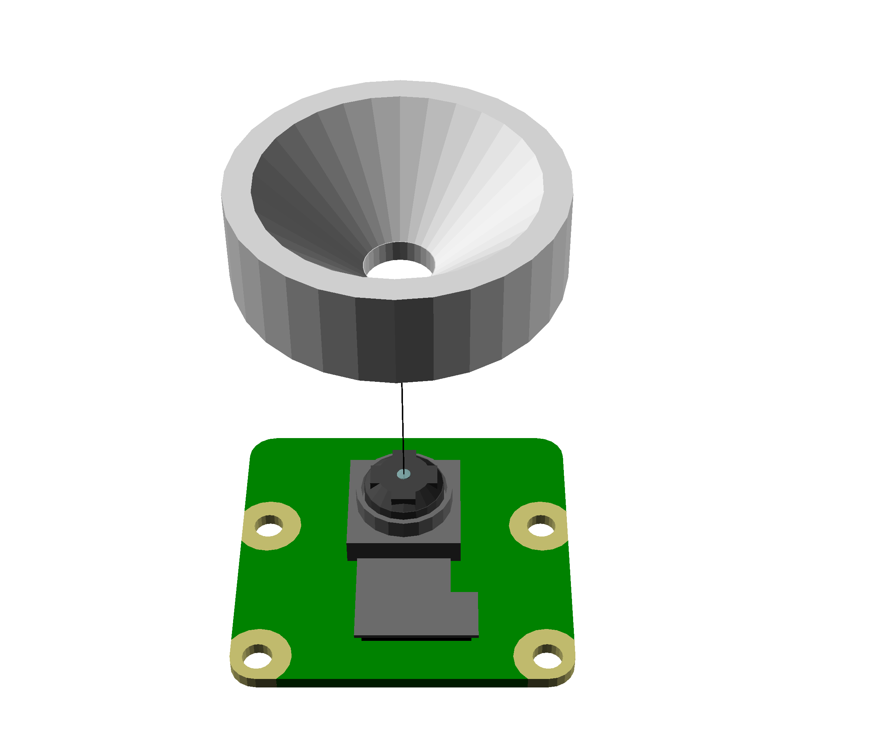
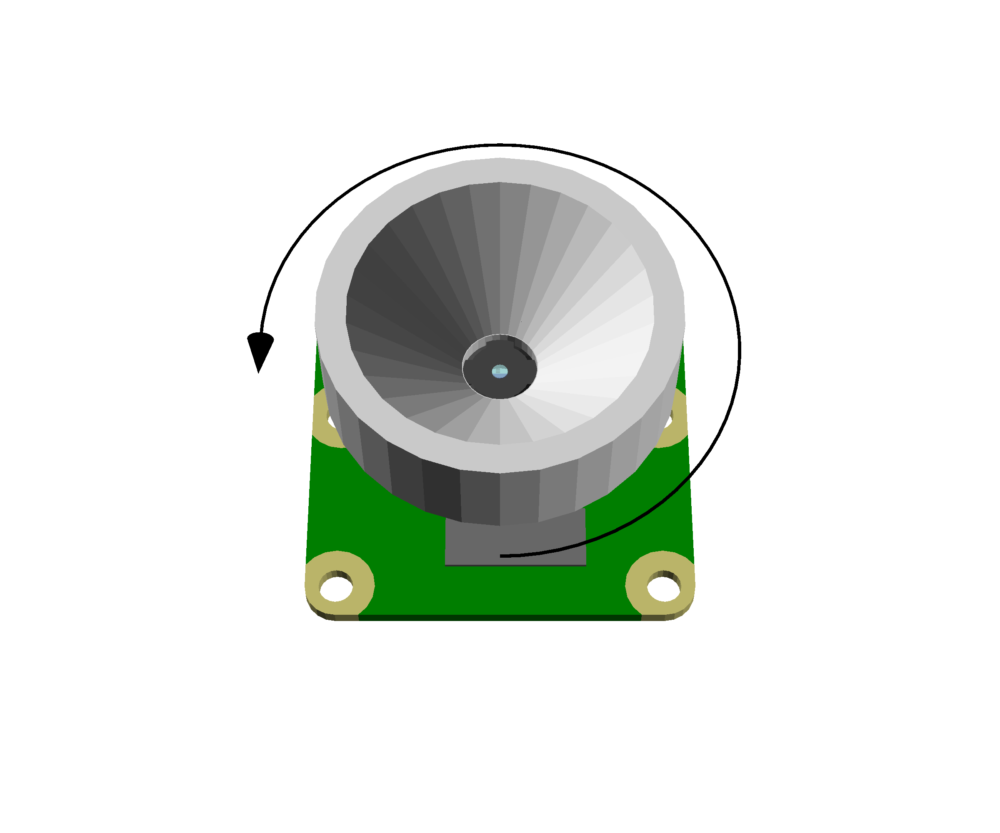
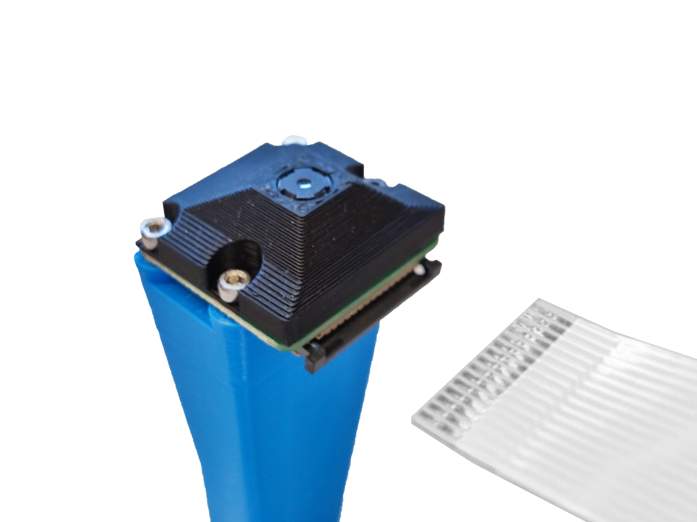

# Assemble the basic optics module

{{BOM}}

[M3 nut]: parts/mech/nuts.md "{cat:mechanic}"
[M2x5mm cap head screw]: parts/mech/M2-5.md "{cat:mechanic}"
[M3x10mm cap head screw]: parts/mech/M3-10.md "{cat:mechanic}"
[Raspberry Pi Camera Module v2]: parts/elect/rpi-camera-v2.md "{cat:electronic}"
[Pi camera ribbon cable]: parts/elect/rpi-camera-ribbon-cable.md "{cat:electronic}"
[1.5mm Ball-end Allen key]: parts/tools/1.5mmBallEndAllenKey.md "{cat:tool}"
[Pi Camera lens tool]: parts/tools/pi_camera_lens_tool.md "{cat:tool, note: 'This should come with the Raspberry Pi Camera Module. If it is missing, you can 3D print a workaround lens remover.'}"
[Lens spacer]: models/lens-spacer.stl "{previewpage}"
[Pi Camera platform]: models/camera-platform.stl "{previewpage}"
[Nitrile gloves]: parts/consumables/gloves.md "{cat:consumable}"
[Tweezers]: parts/tools/tweezers.md "{cat:tool}"

The imaging optics for this workstation version consist of the Raspberry Pi camera and the lens from the camera. To create a microscope, the lens is separated from the camera. This makes quite a good microscope objective with a field of view about 950μm across.

## Visually inspect the lens spacer {pagestep}

Take the [lens spacer][Lens spacer](fromstep){qty:1, cat:printedpart} and confirm that:

* It has been printed in black.
* It is dust free (You can blow air through to clean it)
* The central shaft is not obstructed by strings of plastic.

## Remove Pi Camera Lens {pagestep}

>! **Caution!**
>!
>! The camera board is static sensitive, use [nitrile gloves][Nitrile gloves]{Qty:1} to avoid damage.

* Before touching the Pi Camera, touch a metal-earthed object. If you own one, consider wearing an anti-static strap.
* Take the [Pi Camera][Raspberry Pi Camera Module v2]{qty:1} out of the package. Make sure to **hold it only by the sides of the board**.
* Take the protective film off the lens.
* Take the [Pi Camera lens tool]{qty: 1} and place it over the lens
* Slowly unscrew the lens (About 4 full turns of the tool)
* Carefully lift off the lens.
* Save the lens and the camera. We use both this version of the microscope.

## Push-fit the lens {pagestep}

* Use [tweezers][Tweezers]{Qty:1} to aid in picking up the lens.
* Place the Pi camera lens on a clean surface with the side opposite the camera sensor on the bottom.
* Push the lens spacer down onto the lens until it clicks into place.

## Attach the Pi Camera {pagestep}

* Take the Pi Camera and place it on top of the [pi camera platform][Pi Camera platform](fromstep){qty:1, cat:printedpart}.
* Place the lens spacer over the camera
* Use four [M2x5mm cap head screws][M2x5mm cap head screw]{qty:4} to secure the three parts together using a [1.5mm Ball-end Allen key]{qty:1}
* Take care not to torque the screws.

## Attach the mounting screw {pagestep}

* Take an [M3 nut]{qty:1} and push it into the nut trap from the top
* Take an [M3x10mm cap head screw]{qty: 1} and screw it into the nut.
* Only screw it in a couple of turns. About 5 mm of thread should still be visible

## Connect ribbon cable {pagestep}

* Take the [Pi Camera ribbon cable][Pi camera ribbon cable]{qty:1}
* Pull the catch forward on the exposed Pi Camera connector
* Insert the ribbon cable with the contacts towards the board
* Close the catch on the connector

Set the [complete optics module]{output, qty:1} aside in a safe place.