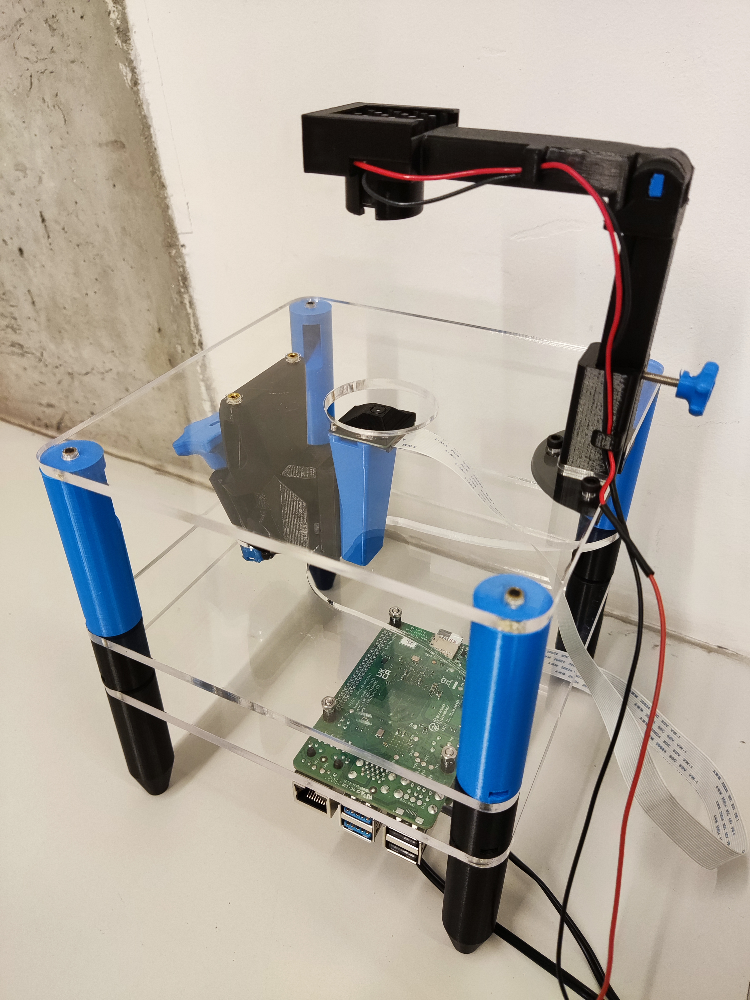

# Assembly complete

Congratulations, you have now assembled your Strobe-Enhaced Microscope Station.

{{BOM}}

[Raspberry Pi Power Supply]: parts/elect/rpi-power-supply.md "{cat:electronic}"
[Strobe Power Supply]: parts/elect/strobe-power-supply.md "{cat:electronic}"
[Voltage regulator]: parts/elect/voltage-regulator.md "{cat:electronic, note:'This regulator has modifications documented [here](https://github.com/wenzel-lab/open-microfluidics-workstation/)'}"

## The completed station {pagestep}

Your completed station should now look like these pictures.  

## Power up the station {pagestep}

To power up your station you will need two 5V/3A power supplies: one with a [USB-C connector][Raspberry Pi Power Supply]{qty:1} for the Raspberry Pi and one with a [male 5.5x2.1mm jack connector][Strobe Power Supply]{qty:1} for the strobe illumination.

Use a [voltage regulator][Voltage regulator]{qty:1} to supply 3V to the strobe. Higher voltage can damage it.

## Software set-up {pagestep}

Setting up the software is included in the next section of instructions. It is detailed in ["Software Installation" page]. Using the software is described in the ["Use your Station" page].

["Software Installation" page]: software-installation.md
["Use your Station" page]: usage.md