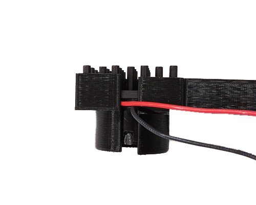
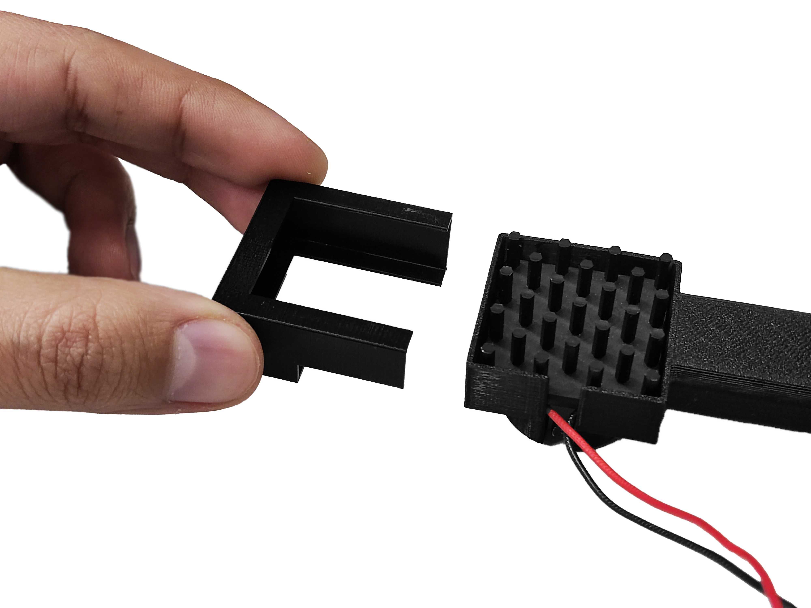
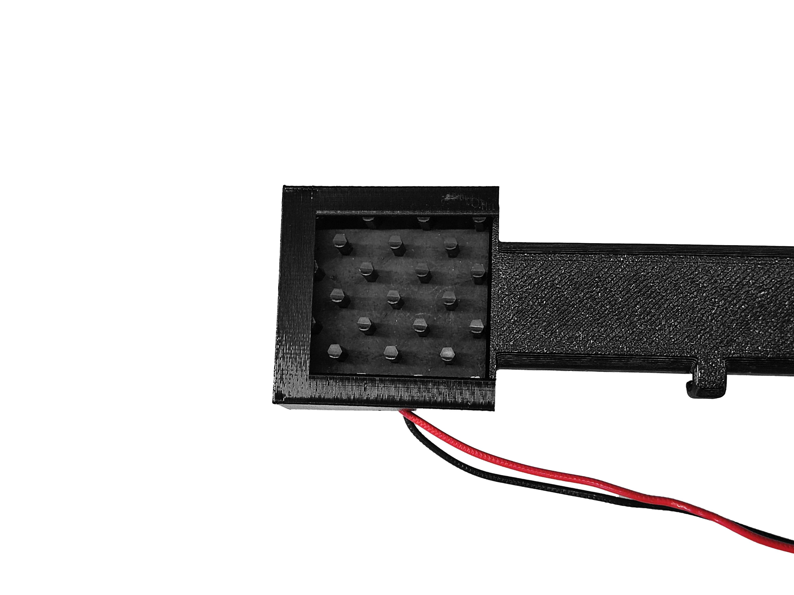
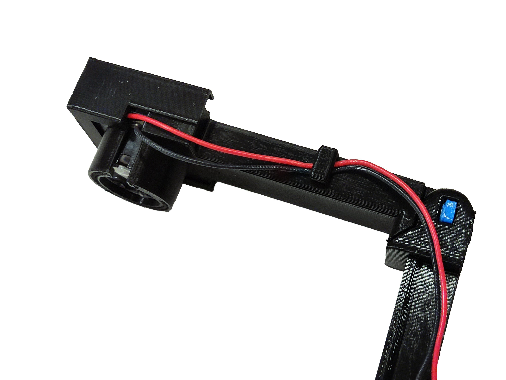
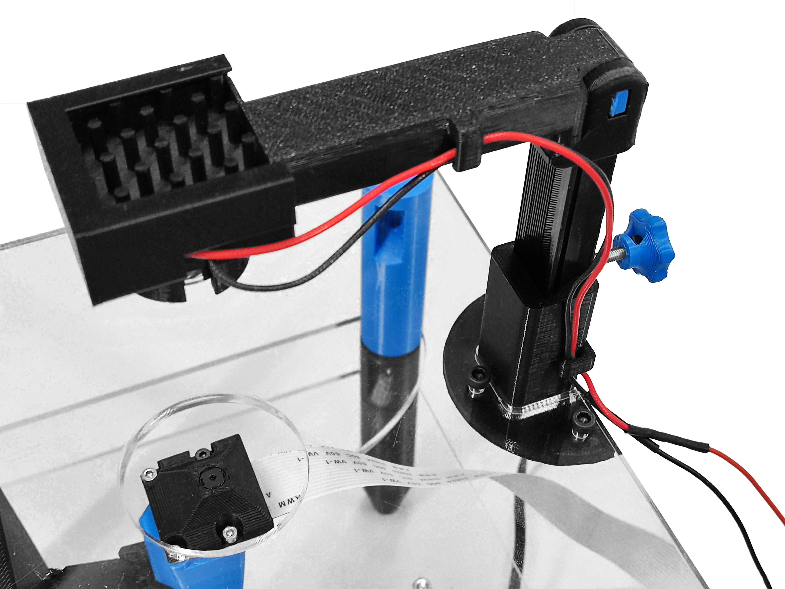

# Assemble the illumination

{{BOM}}

[M3x10mm cap head screw]: parts/mech/M3-10.md "{cat:mechanic}"
[M3x20mm pozi pan head screw]: parts/mech/X-M3-20.md "{cat:mechanic}"
[M3 nut]: parts/mech/nuts.md "{cat:mechanic}"
[Heat insert]: parts/mech/Hinsert.md "{cat:mechanic}"
[High-power star LED]: parts/elect/high-power-star-LED.md "{cat:electronic}"
[30x30x10mm Heat sink]: parts/elect/30x30x10mm-heatsink.md "{cat:electronic}"
[Male Crimp Pin]: parts/elect/male-crimp-pin.md "{cat:electronic}"
[2 pin Du Pont connector female housing]: parts/elect/2pin-DuPont-female-housing.md "{cat:electronic}"  
[Double-sided thermal tape]: parts/elect/double-sided-thermal-tape.md "{cat:electronic}"
[Double-sided self adhesive tape]: parts/elect/double-sided-adhesive-tape.md "{cat:electronic}"
[Star-LED lens]: parts/optics/8.7-20mm-circular-lens.md "{cat:optical}"
[2.5mm Ball-end Allen key]: parts/tools/2.5mmBallEndAllenKey.md "{cat:tool}"
[#1 pozidrive screwdriver]: parts/tools/screwdriver.md "{cat:tool}"
[Soldering iron]: parts/tools/soldiron.md "{cat:tool}"
[Needle-nose plier]: parts/tools/pliers.md "{cat:tool}"
[Precision wire cutter]: parts/tools/precision-wire-cutters.md "{cat:tool}"
[Crimper]: parts/tools/crimper.md "{cat:tool}"
[Top plate]: parts/materials/top-plate.md
[Illumination base]: models/illumination-base.stl "{previewpage}"
[Illumination slider]: models/illumination-slider.stl "{previewpage}"
[Illumination thumbscrew]: models/illumination-thumbscrew.stl "{previewpage}"
[Illumination arm]: models/led-arm.stl "{previewpage}"
[Hinge pin]: models/arm-pin.stl "{previewpage}"
[LED cover]: models/led-cover.stl "{previewpage}"
[Conductor Flexible Cables]: parts/elect/protoboard-cables.md "{cat:electronic}"
[Nitrile gloves]: parts/consumables/gloves.md "{cat:consumable}"

In this section, we are assembling the strobe illuminator. This mounts the high-power LED and condenser lens above the sample so the microscope can image the transmitted light.

## Mount the base {pagestep}

* Place the [illuminator base][Illumination base](fromstep){qty:1, cat:printedpart} onto the [top plate][Top plate] in opposite orientation to the focusing actuator.
* Secure in place with three [M3x10mm screws][M3x10mm cap head screw]{qty:3} and three [M3 nuts][M3 nut]{qty: 3} (using a [2.5mm Ball-end Allen key]{qty:1})

## Assemble the slider {pagestep}

**2.1) illuminator thumbscrew**

* Push a [M3 nut]{qty: 1} into the slot in the [illuminator thumbscrew][Illumination thumbscrew](fromstep){qty:1, cat:printedpart}.
* Screw a [M3x20mm pozi pan head screw]{qty: 1,cat: mechanic} into the [thumbscrew][Illumination thumbscrew]. Use a [#1 pozidrive screwdriver]{qty:1}.

>! Be sure to properly clean the nut and screw holes before using them, if not it might break.

>i If the screw don´t go fully inside, you can do it with a plier and a screwdriver.

**2.2) Illuminator slider:**

* Positionate a [heat insert]{qty:1} in the round hole of the [illuminator slider][Illumination slider](fromstep){qty:1, cat:printedpart}
* Apply heat to the [insert][heat insert] (using a [soldering iron][Soldering iron]{Qty:1}) and use gentle force to push it into position as decribed in the [guide to use heat inserts].
* Screw the [thumbscrew][Illumination thumbscrew] assembly into the [heat insert] in the [illuminator slider][Illumination slider].

>!! **Warning** 
>!!
>!! To ensure the slider works properly, it is necesary for the thinner section of the *illuminator slider* to break. This can be done using a plier.

## Mount the light holder {pagestep}

* Put the [illumination slider][Illumination slider] together with [illumination arm][Illumination arm](fromstep){qty:1, cat:printedpart}, and align the holes.
* Use a [hinge pin][Hinge pin](fromstep){qty:1, cat:printedpart} to connect them. Insert it into the rectagular side of the [slider][Illumination slider].
* It should take a little bit of force to push it through the holes. A [needle-nose plier][Needle-nose plier]{qty:1} can be useful.

## Assemble the condenser lens, LED, and heatsink {pagestep}

>!! For this step use [Nitrile gloves]{Qty:1}

* Fasten a [high-power LED][High-power star LED]{qty:1} to a [heat sink][30x30x10mm Heat sink]{qty:1} using a [double-sided thermal tape][Double-sided thermal tape]{qty:1} as described in this [guide][guide-LED-to-heatsink]. 
* To fit the cables, make a V cut in the [20 mm circular lens] [Star-LED lens] using [Precision wire cutter]{qty:1}, following the direction of the existing space. 
* Fasten the assembly to a [20 mm circular lens][Star-LED lens]{Qty:1} using a [double-sided self adhesive tape][Double-sided self adhesive tape]{qty:1} as described in this [guide][guide-LED-to-lens].
* This is the final assembly

## Assemble the illumination wiring {pagestep}

* Take the red and black [cables][Conductor Flexible Cables]{Qty:2} of the illumination assembly and crimp them using two [male connectors][Male Crimp Pin]{qty:2} and a [crimper][Crimper]{qty:1} as described in this [guide][guide-dupont-connector].
* Attach a [2 pin Du Pont connector female housing]{qty:1} to it.
* This is the illumination wiring

## Mount the illumination assembly {pagestep}

* Position the illumination assembly in the [illumination arm][Illumination arm]. One side of the LED holder has a space for cables.
* Secure the assembly using a [cover][LED cover](fromstep){qty:1, cat:printedpart}.There is also space for cables, use it as reference.

## Attach the illumination wiring {pagestep}

* Insert the illumination wiring to the cable clip next to LED holder
* Mount the [illumination arm][Illumination arm] assembly to the [base][Illumination base]
* Insert the illumination wiring to the other cable clip in the [base][Illumination base]

## Connect the strobe {pagestep}

* Connect DuPont female 2-pin connector of the strobe cable to the 2-pin male connector of the illumination wiring. Be careful to connect positive and negative terminals in wrong position.

[guide to use heat inserts]: https://hackaday.com/2019/02/28/threading-3d-printed-parts-how-to-use-heat-set-inserts/
[guide-LED-to-heatsink]: https://youtu.be/ZD3UFZiaZ74
[guide-LED-to-lens]: https://youtu.be/DwR9CUMfGJU
[guide-dupont-connector]: https://youtu.be/jET1QTP1B7c