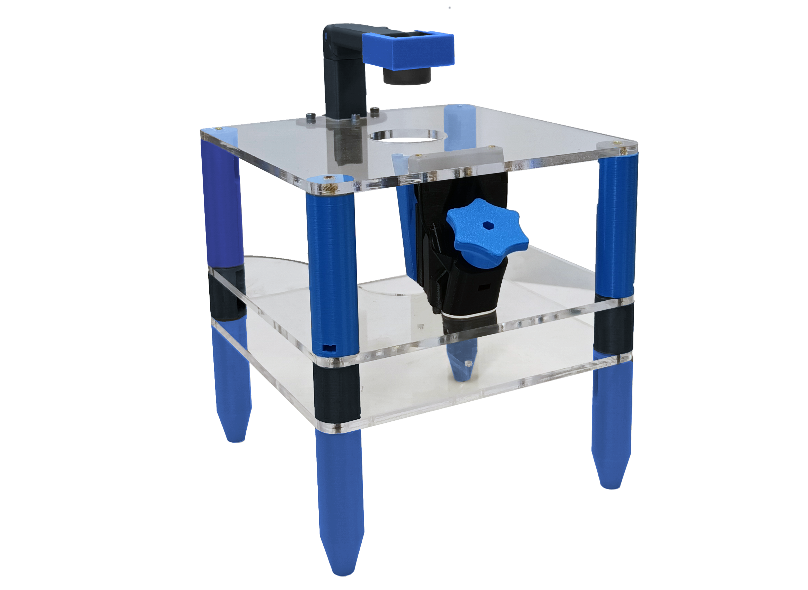

# 3 levels Stage

This  <a href="https://librehub.github.io/" target="_blank">LIBRE hub</a> project consists in a Open mycrofluidic working station applied with 3D printing an laser cutting and it's based on the <a href="https://rwb27.gitlab.io/openflexure-flat-top-microscope/" target="_blank">OpenFlexure flat-top microscope</a> and it's applied to the study of droplets.

LINKS:
* [.](printing.md){step} 

* [.](testpage1.md){step}

* [.](testpage2.md){step}

* [.](electronics.md){step}

* [.](code.md){step}

* [bill of materials]{BOM}