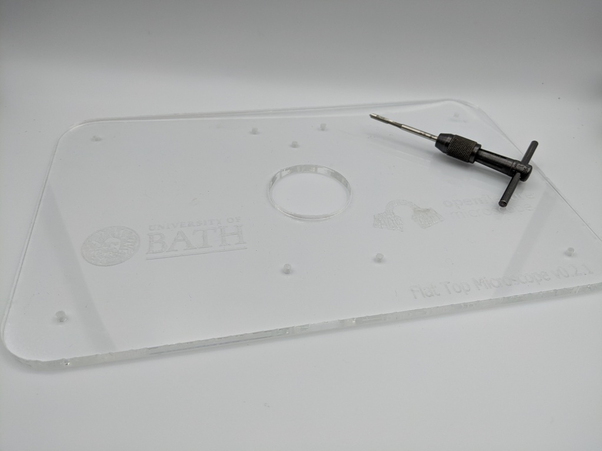

# Laser cut the acrylic parts

{{BOM}}

[52x18x0.5cm Acrylic sheet]: parts/materials/acrylic-sheet.md "{cat:material}"
[Laser cutting machine]: parts/tools/laser-cutting-machine.md "{cat:tool}"
[Tap wrench]: parts/tools/tap-wrench.md "{cat:tool}"
[M3 tap]: parts/tools/m3-tap.md "{cat:tool}"
[Lubricant]: parts/consumables/tap-lubricant.md "{cat:consumable}"

## Set your laser cutting machine settings {pagestep}

Laser-cutting acrylics is relatively simple. The basic steps for achieving good-quality cut acrylic parts are listed [here].

Settings for laser cutting acrylics will vary according to the machine. The table below lists the settings we used: 

|Setting     |Value        |
|------------|--           |
|Material    |Acrylic 5mm |
|Power (W)   |50 |
|Speed (mm/s)|10 |

We recommend testing the parameters for acrylic laser cutting using a test matrix. Download and laser cut the [test matrix](parts/materials/test-matrix.md) file. This will only use about an 8x9x0.5cm acrylic sheet.

The result should look like this:

## Laser cutting {pagestep}

Now you have tested your [laser cutting machine][Laser cutting machine]{qty: 1} and [acrylic sheet][52x18x0.5cm Acrylic sheet]{Qty: 1} you can laser cut the following parts:

* [Top plate]{output,qty:1} (17x17x0.5cm): [top-plate.dxf](parts/materials/top-plate.md)
* [Middle plate]{output,qty:1} (17x17x0.5cm): [middle-plate.dxf](parts/materials/middle-plate.md)
* [Bottom plate]{output,qty:1} (17x17x0.5cm): [bottom-plate.dxf](parts/materials/bottom-plate.md)

## Clean up through holes {pagestep}

Before assembling the workstation, tap the holes in the laser-cut acrylic sheets to insert the heat-set inserts. The acrylic pieces, the top plate, the middle plate, and the bottom plate have several holes that must be tapped.

### Tap holes

* Use an [M3 tap]{qty:1} mounted in a [tap wrench]{qty:1} to tap all the holes in the top plate. It helps to use some [lubricant][Lubricant]{qty:a little} when you tap the holes, and to make 2 turns "screwing in" the tap then half a turn "unscrewing" as described in the [guide to tapping acrylic].
* All holes in the top plate are intended to be tapped. There are no M3 through holes here. Tapping the holes before removing any protective film from the acrylic is probably the easiest to help keep debris off the plastic.

* Several holes in the middle plate and bottom plate should be tapped. However, there are both tapped and through holes in these plates: if the hole is too big, and the [M3 tap] fits in without "biting" the plastic, you probably don't need to tap the hole.

* If any of the M3 clearance holes in the bottom plate are too tight to get a heat-set insert through comfortably, you could open them up using a 3mm drill bit at this point.

### Remove film

* If there is protective film on the acrylic, remove it now.

* Your plates are now prepared and ready to use.

[guide to tapping acrylic]: http://www.ultimatehandyman.co.uk/how-to/acrylic/tapping-acrylic
[here]: https://www.xometry.com/resources/sheet/about-laser-cutting-acrylic/