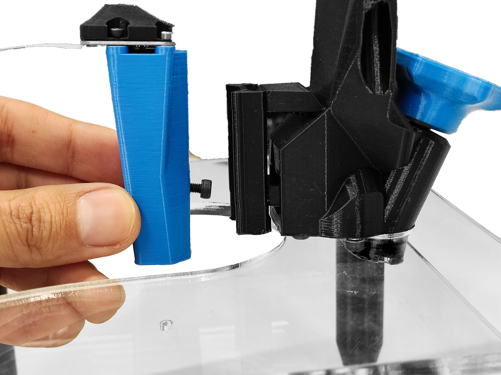
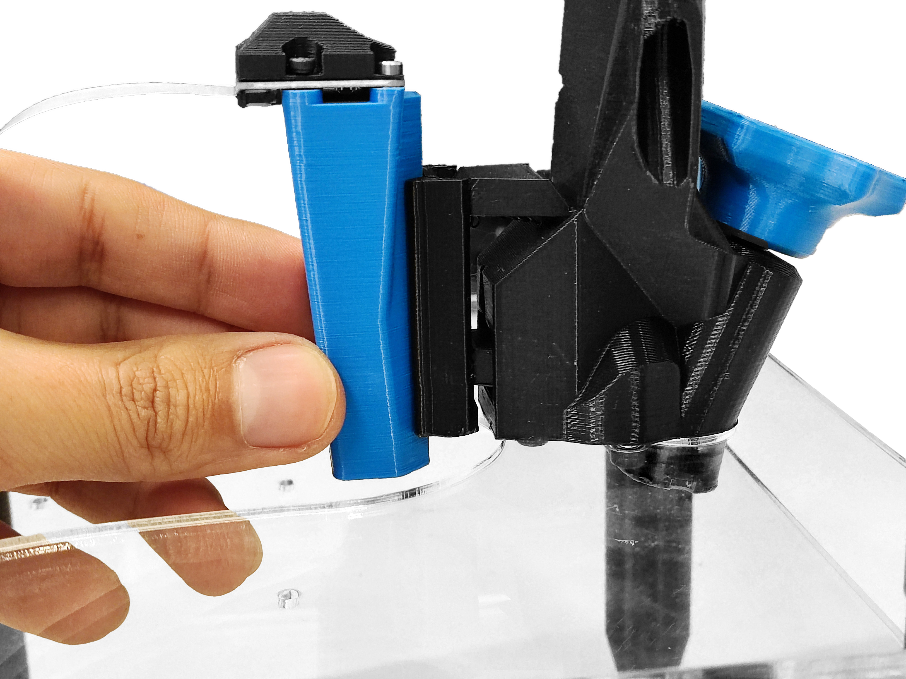

# Mount the optics

{{BOM}}

[2.5mm Ball-end Allen key]: parts/tools/2.5mmBallEndAllenKey.md "{cat:tool}"

## Mount the optics assembly {pagestep}

* Get the [2.5mm Ball-end Allen key]{qty:1} ready
* Take the [complete optics module](fromstep){qty:1, cat:subassembly} and pass it between the top and middle plates of the [main structure](fromstep){qty:1, cat:subassembly}.
* Insert the exposed mounting screw on the optics module through the keyhole on the z-actuator.

## Adjust the optics assembly {pagestep}

* Insert the Allen key through the teardrop-shaped hole on the front of the z-actuator until it engages with the mounting screw.
* Slide the optics module up the keyhole as high as possible.
* Tighten the screw with the Allen key to lock the optics.

