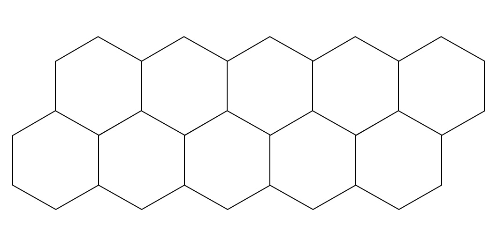

# Double-sided Thermal Tape

Tape with adhesive on both sides, specifically designed for transferring heat between two surfaces.
It is commonly used to attach heat sinks or cooling components to electronic devices for effective heat dissipation.
This tape ensures efficient thermal management in applications such as electronics, computers, and LED lighting.

_Supplier:_ [Luxeonstar](https://luxeonstar.com/product/lxt-s-12/)