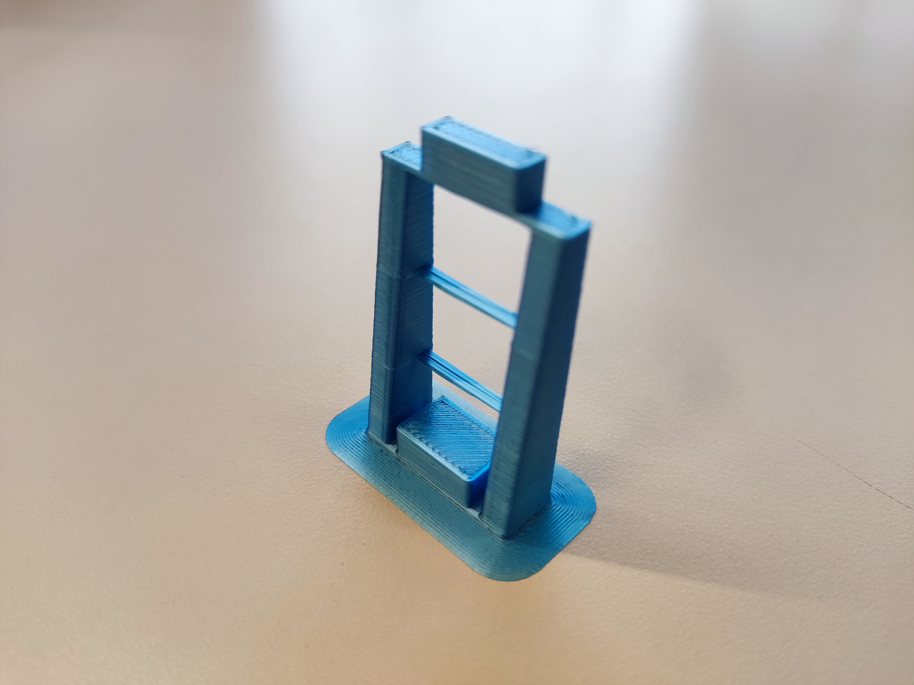
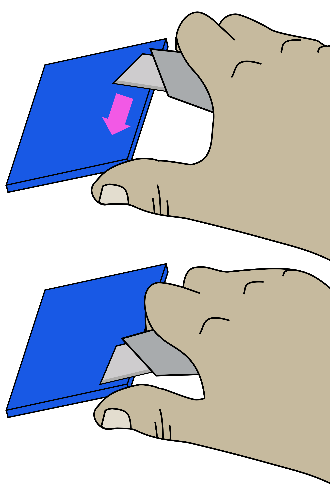

# Print the plastic parts

{{BOM}}

[PLA filament]: parts/materials/pla_filament.md "{cat:material}"
[Black PLA filament]: parts/materials/black_pla_filament.md "{cat:material}"
[RepRap-style printer]: parts/tools/rep-rap.md "{cat:tool}"
[Precision wire cutter]: parts/tools/precision-wire-cutters.md "{cat:tool}"
[Utility knife]: parts/tools/utility-knife.md "{cat:tool}"
[leg test]:models/leg_test.stl "{previewpage}"

## Set your printer settings {pagestep}

Almost all station parts can be printed out of [PLA filament] on most [RepRap-style printers][RepRap-style printer]{qty:1}.

We recommend the following printer settings:

|Setting        |Value          |
|------------   |--             |
|Material       |PLA            |
|Material Temperature |Recommended by the PLA brand|
|Layer height   |0.2mm or less  |
|Infill         |Printer default|
|Brim           |Recommended for all parts|
|Slice gap closing radius |0.001mm |

Test whether your printer can print the pieces for this station or other open-source designs. Download and print the [leg test] file. This will only use about [5 grams of PLA][PLA filament]{qty: 5g}.

The result should look like this (this has been printed with a brim):

As a general rule, strength is more important than surface finish, so very thin layers (less than 0.15mm or so) are unlikely to result in a station that performs any better, though it may approve the appearance.

## Printing {pagestep}

Now you have tested your [3D printer][RepRap-style printer] and [filament][PLA filament]{qty: 200g, note:"Of any colour you want"} you can print the following parts:

* Actuator assembly tools ([nut tool]{output,qty:1}, [band tool]{output,qty:1}, and [band tool cover]{output,qty:1}): [actuator_assembly_tools.stl](models/actuator-assembly-tools.stl){previewpage}
* [Focusing assembly]{output,qty:1}: [focusing-assembly.stl](models/focusing-assembly.stl){previewpage}
* [Actuator Foot]{output,qty:1}: [z_foot.stl](models/z_foot.stl){previewpage}
* [Thumbwheel]{output,qty:1}: [thumbwheel.stl](models/thumbwheel.stl){previewpage}
* [Pi camera platform]{output,qty:1}: [camera-platform.stl](models/camera-platform.stl){previewpage}
* [Lens spacer]{output,qty:1}: [lens-spacer.stl](models/lens-spacer.stl){previewpage} - **This must be printed in [black][Black PLA filament]{qty: 50g}!**
* [Illumination base]{output,qty:1}: [illumination-base.stl](models/illumination-base.stl){previewpage} - **This must be printed with support**
* [Illumination slider]{output,qty:1}: [illumination-slider.stl](models/illumination-slider.stl){previewpage}
* [Illumination thumbscrew]{output,qty:1}: [illumination-thumbscrew.stl](models/illumination-thumbscrew.stl){previewpage}
* [Illumination arm]{output,qty:1}: [led-arm.stl](models/led-arm.stl){previewpage} - **This must be printed with support**
* [Hinge pin]{output,qty:1}: [arm-pin.stl](models/arm-pin.stl){previewpage}
* [LED cover]{output,qty:1}: [led-cover.stl](models/led-cover.stl){previewpage}
* [Standoff-S]{output,qty:4}: [standoff-S.stl](models/standoff-S.stl){previewpage}
* [Standoff-M]{output,qty:4}: [standoff-M.stl](models/standoff-M.stl){previewpage}
* [Foot-M]{output,qty:4}: [foot-M.stl](models/foot-M.stl){previewpage}
* [Spacer-S]{output,qty:4}: [spacer-4mm.stl](models/spacer-4mm.stl){previewpage}
* [Spacer-M]{output,qty:2}: [spacer-11mm.stl](models/spacer-11mm.stl){previewpage}

In case you want to print the plates instead of laser cutting them: [top-plate.stl](models/top-plate.stl){previewpage}, [middle-plate.stl](models/middle-plate.stl){previewpage}, and [bottom-plate.stl](models/bottom-plate.stl){previewpage}

You can [download all the STLs as a single zipfile](models/STLs.rar) (plates are not included).

## Clean-up of printed parts {pagestep}

>!! **Be careful when removing brim**
>!!
>!! To avoid injury, first remove the bulk of the brim without a knife. Remove the remaining brim with a peeling action as described below.

Carefully remove the printing brim from all parts. To remove brim:

1. Use [precision wire cutters][Precision wire cutter]{qty: 1} to remove most of the brim from the part.
2. Clean up the remaining brim with a [utility knife][Utility knife]{qty: 1, note: "Not a scalpel!"}:
    * Hold the knife in your dominant hand with 4 fingers curled around the handle, leaving your thumb free.
    * Hold the part in your other hand, as far away from the surface, to be cut as possible.
    * Support the part with the thumb of your dominant hand.
    * Place the blade on the surface to be cut, and carefully close your dominant hand, moving the blade, under control, towards your thumb.

