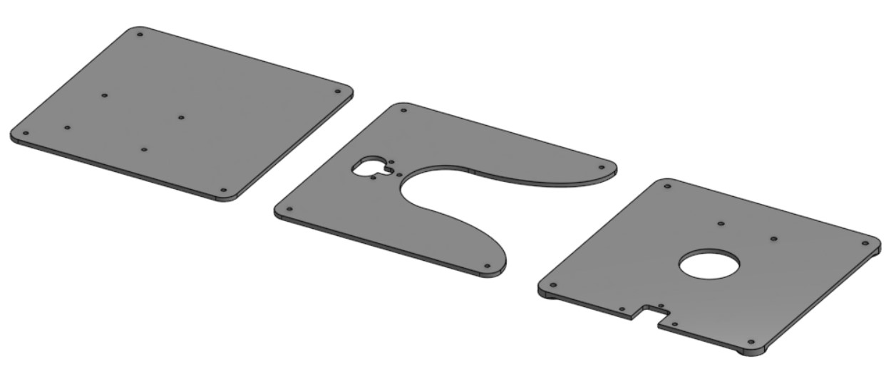

# 3D printable plates

[3D printable Top]: ../3D-print-plates/models/3D-Top-plate.stl "{previewpage}"
[3D printable Middle]: ../3D-print-plates/models/3D-Middle-plate.stl "{previewpage}"
[3D printable Bottom]: ../3D-print-plates/models/3D-Bottom-plate.stl "{previewpage}"

This correspond to a variation of the original model, making plates that can be done with a 3D printer. The steps for building with this adaptation are the same as the original version.

These are classified in:

* [3D printable Top]{Qty: 1, Cat: printedpart}. 
* [3D printable Middle]{Qty: 1, Cat: printedpart}. 
* [3D printable Bottom]{Qty: 1, Cat: printedpart}. 