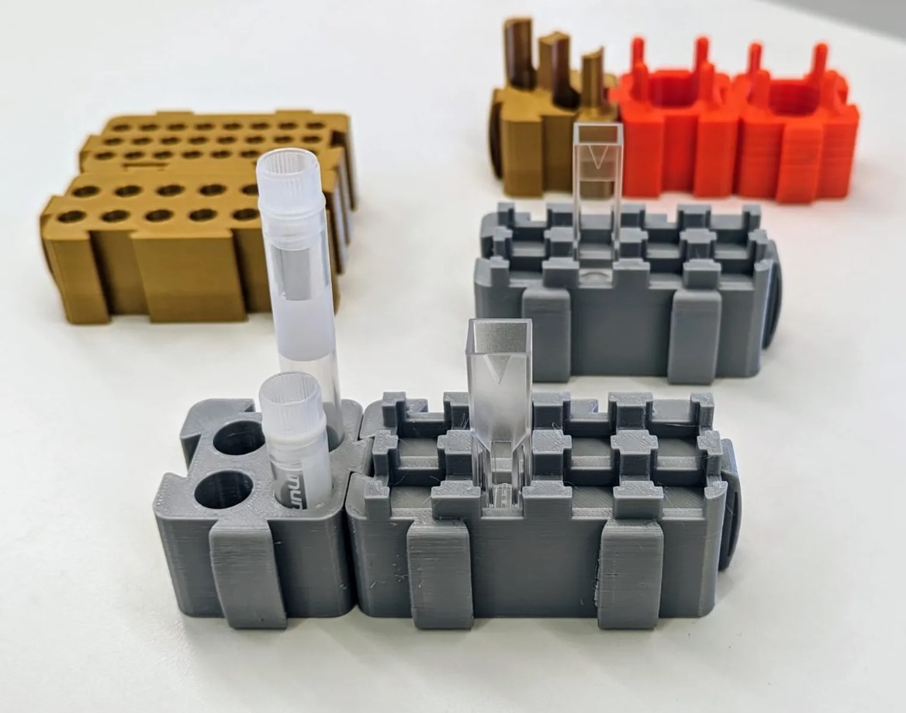

# Individual holders

[0.2ml double]: ../Individual-holders/models/0.2ml-double.stl "{previewpage}"
[0.6ml double]: ../Individual-holders/models/0.6ml-double.stl "{previewpage}"
[1.5ml single]: ../Individual-holders/models/1.5ml-single.stl "{previewpage}"
[50ml single]: ../Individual-holders/models/50ml-single.stl "{previewpage}"
[Cryo vial single]: ../Individual-holders/models/Cryo-vial-single.stl "{previewpage}"
[Cuvettes double thicker]: ../Individual-holders/models/Cuvettes-double-thicker.stl "{previewpage}"
[Cuvettes double thinner]: ../Individual-holders/models/Cuvettes-double-thinner.stl "{previewpage}"

This is a modular and pluggable system designed for holding laboratory tubes.

They can easily be printed with PLA or other filament types (PTEG recommended for use in incubators). The dovetail slots ensure a perfect fit for all pieces.
This models correspond to improvements to the original design from the [DormantBiology Lab](https://dormantbiologylab.org/resources/).

If you want to have access to the modifiable design on OnShape, then click
[here](https://cad.onshape.com/documents/97d51c388847ba8cb8413853/w/289142d28ccd54a067c097cd/e/32d5910bef8d29fe50dcddab).

There are various options:

* [0.2ml double]{Qty: 1, Cat: printedpart}. 
* [0.6ml double]{Qty: 1, Cat: printedpart}. 
* [Cuvettes double thinner]{Qty: 1, Cat: printedpart}. 
* [Cuvettes double thicker]{Qty: 1, Cat: printedpart}. 
* [1.5ml single]{Qty: 1, Cat: printedpart}. 
* [50ml single]{Qty: 1, Cat: printedpart}. 
* [Cryo vial single]{Qty: 1, Cat: printedpart}. 

