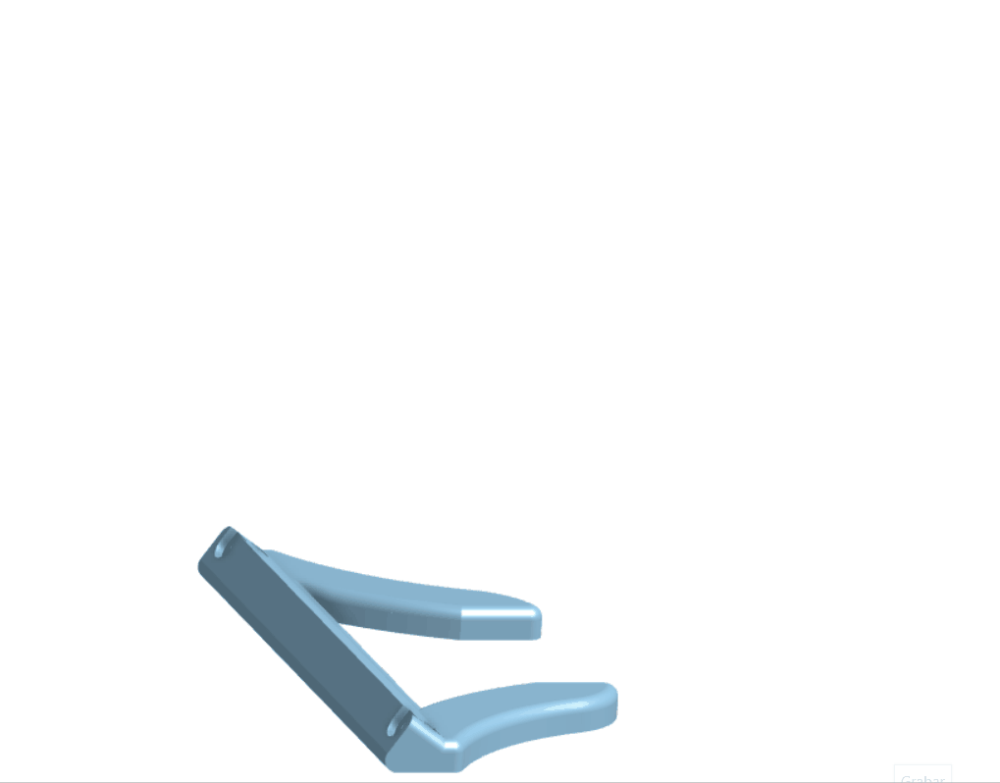
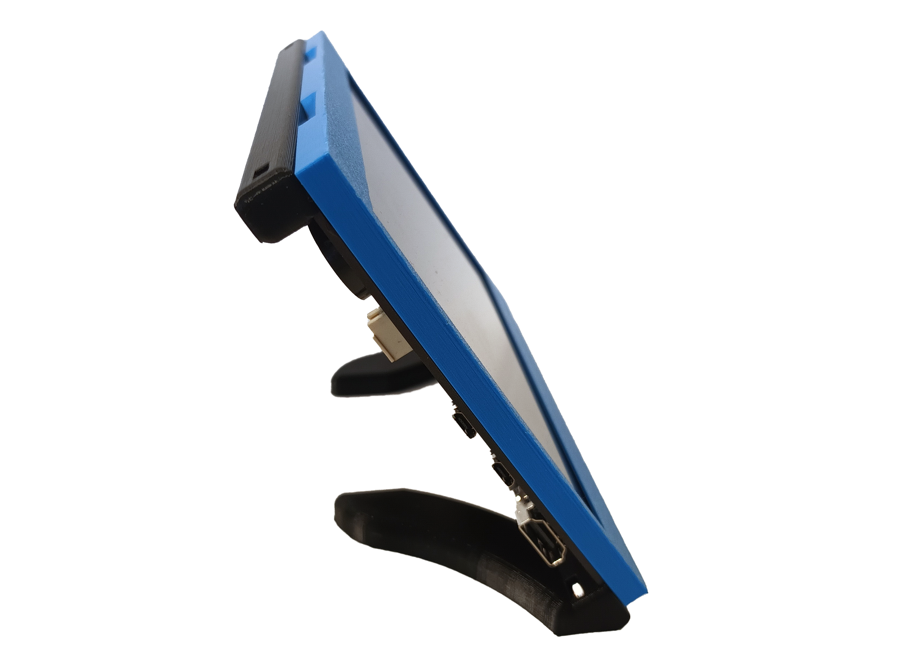

# Screen holder
###Building
{{BOM}}

[2.5mm Ball end Hex key]: ../parts/tools/2.5mmBallEndAllenKeyVari.md "{cat:tool}"
[M3 nuts]: ../parts/mech/nutsVari.md "{cat:mechanic}"
[M3x10mm cap head screws]: ../parts/mech/M3-10Vari.md "{cat:mechanic}"
[Screen case]: ../Screen-holder/models/screencase.stl "{previewpage}"
[Screen top]: ../Screen-holder/models/screentop.stl "{previewpage}"
[Screen base]: ../Screen-holder/models/screenbase.stl "{previewpage}"

When it comes to the screen holder made for the [7-inch capacitive touch screen for Raspberry Pi](https://es.aliexpress.com/item/1005004248297471.html?pdp_npi=2%40dis%21CLP%21CLP8.211%21CLP6.572%21%21%21%21%21%402101c5c216845279301748667e7f22%2112000028516842616%21btf&_t=pvid%3A1633c580-e52f-49bd-8d4e-dc5f8abeaa50&afTraceInfo=1005004248297471__pc__pcBridgePPC__xxxxxx__1684527930&spm=a2g0o.ppclist.product.mainProduct&gatewayAdapt=glo2esp){Qty: 1}, the process is quite straightforward. 

All you need to do is follow a few simple steps. First, gather four [M3x10mm cap head screws]{Qty: 4} and four [M3 nuts]{Qty: 4}. Securely screw the corresponding parts onto the screen using the[2.5mm Ball end Hex key]{Qty: 1} , ensuring that each screw is tightly fastened and each nut is securely plugged into the [Screen top]{Qty: 1, Cat: printedpart} and [Screen base]{Qty: 1, Cat: printedpart}. 

Once the parts are firmly in place, you can proceed to attach the [Screen case]{Qty: 1, Cat: printedpart}. 
Simply align the protector with the screws and carefully affix it to ensure a snug fit. By following these steps, you'll be able to effectively install the screen holder and safeguard your device's display.

