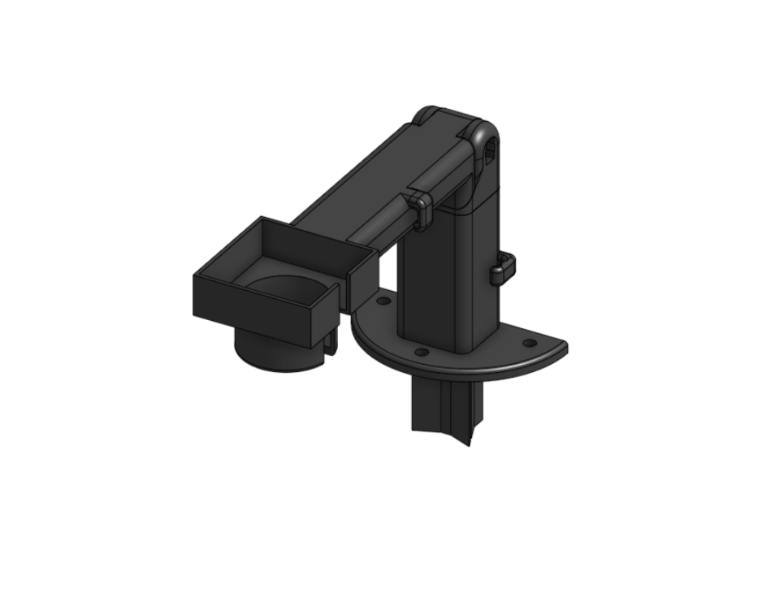

[Heat sink cover]: ../heatsink/models/cover.stl "{previewpage}"
[Heat sink spacer]: ../heatsink/models/spacer.stl "{previewpage}"

# 25mm Heat sink

Sometimes, certain products may have limited availability which can be inconvenient. In such situations, having an alternative option can be helpful.

In the case of possessing a 25mm. heat sink instead of the original 30mm., this variation can be implemented.

* [Heat sink cover]{Qty: 1, Cat: printedpart}. 
* [Heat sink spacer]{Qty: 1, Cat: printedpart}. 