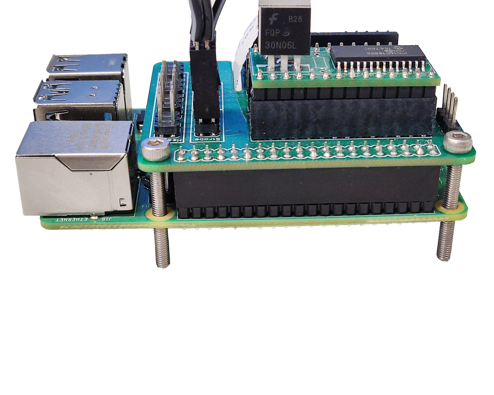

# Mount the electronics

These instructions assume you use a Raspberry Pi v4, a Pi Hat, and the Strobe module.

{{BOM}}

[M3x25mm cap head screw]: parts/mech/m3x25mm-cap-head-screw.md "{cat:mechanic}"
[M3 nut]: parts/mech/m3_nut.md "{cat:mechanic}"
[Raspberry Pi]: parts/elect/rpi-v4.md "{cat:electronic}"
[Pi Hat]: parts/elect/pi-hat.md "{cat:electronic}"
[Strobe Module]: parts/elect/strobe-module.md "{cat:electronic}"
[Strobe Cable]: parts/elect/strobe-cable.md "{cat:electronic}"
[Needle-nose plier]: parts/tools/needle-nose_plier.md "{cat:tool}"
[2.5mm Ball-end Allen key]: parts/tools/2.5mmBallEndAllenKey.md "{cat:tool}"
[Spacer-S]: models/spacer-4mm.stl "{previewpage}"
[Spacer-M]: models/spacer-11mm.stl "{previewpage}"

>i **Alternative electronics options**
>i
>i Currently, no alternative electronics have been tested yet, but you can find [other solutions] based on different boards, such as Teensy board, for controlling a strobe.

[other solutions]: https://github.com/DropletKitchen/strobe "Light Strobing to Improve Images from Cameras"

## Connect the camera {pagestep}

* Insert the ribbon cable from the optics module into the camera port of the [Raspberry Pi]{qty:1}, ensuring the contacts are on the opposite side of the clasp. There are [detailed instructions on the Raspberry Pi website](https://projects.raspberrypi.org/en/projects/getting-started-with-picamera/2).

## Prepare the electronics {pagestep}

* Place the [strobe module][Strobe Module]{qty:1} over the [Pi hat][Pi Hat]{qty:1}.
* Mount the Pi hat on the Raspberry Pi GPIO headers. There is a space to place the ribbon cable.

* Connect the 5-pin double row DuPont female connector of the [strobe cable][Strobe Cable]{qty:1} to the Pi hat.

## Mount the boards {pagestep}

* Take four [M3x25mm cap head screws][M3x25mm cap head screw]{qty: 4} and insert them into each hole from the Pi hat and the Raspberry Pi. Use a [2.5mm Ball-end Allen key]{qty:1}.
* Use a [11mm spacer][Spacer-M](fromstep){qty: 2, cat:printedpart} in between the holes next to the power supply and USB connectors to improve the stacking. A [needle-nose plier][Needle-nose plier]{qty:1} can be helpful to hold the spacer while you screw.

* Use a [4mm spacer][Spacer-S](fromstep){qty: 4, cat:printedpart} in between the assembly and the bottom plate.
* Place the assembly in the bottom plate and attach it to the surface using four [M3 nuts][M3 nut]{qty: 4}. A [needle-nose plier][Needle-nose plier] can be helpful to hold the nut.

  